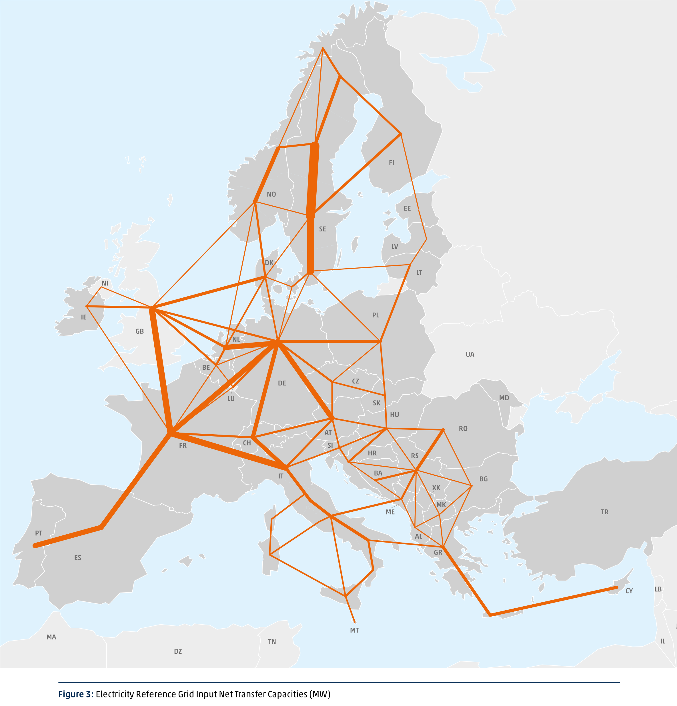
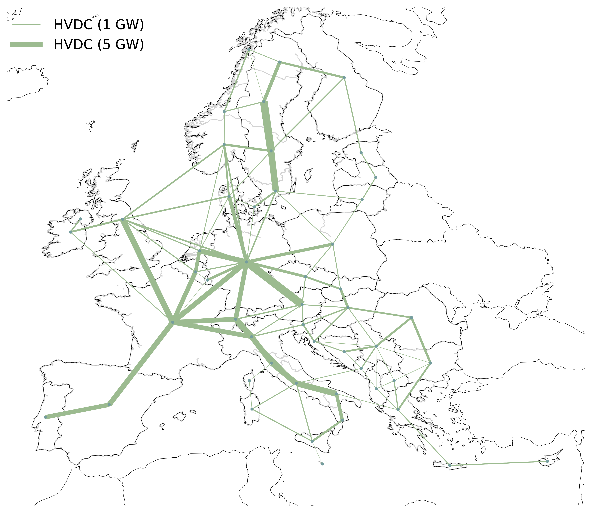
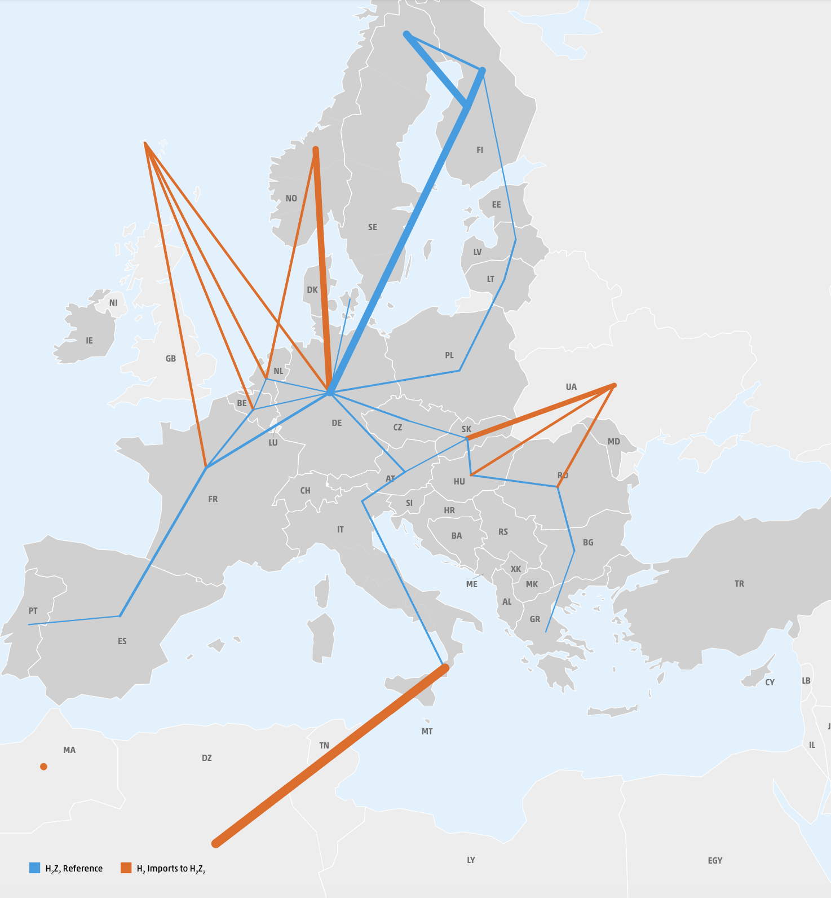
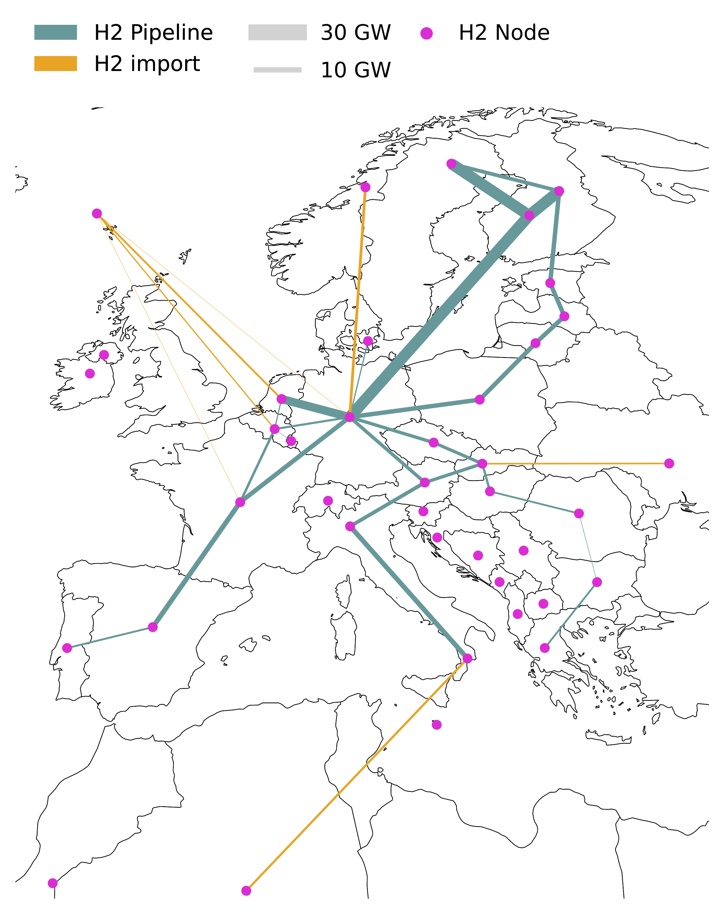
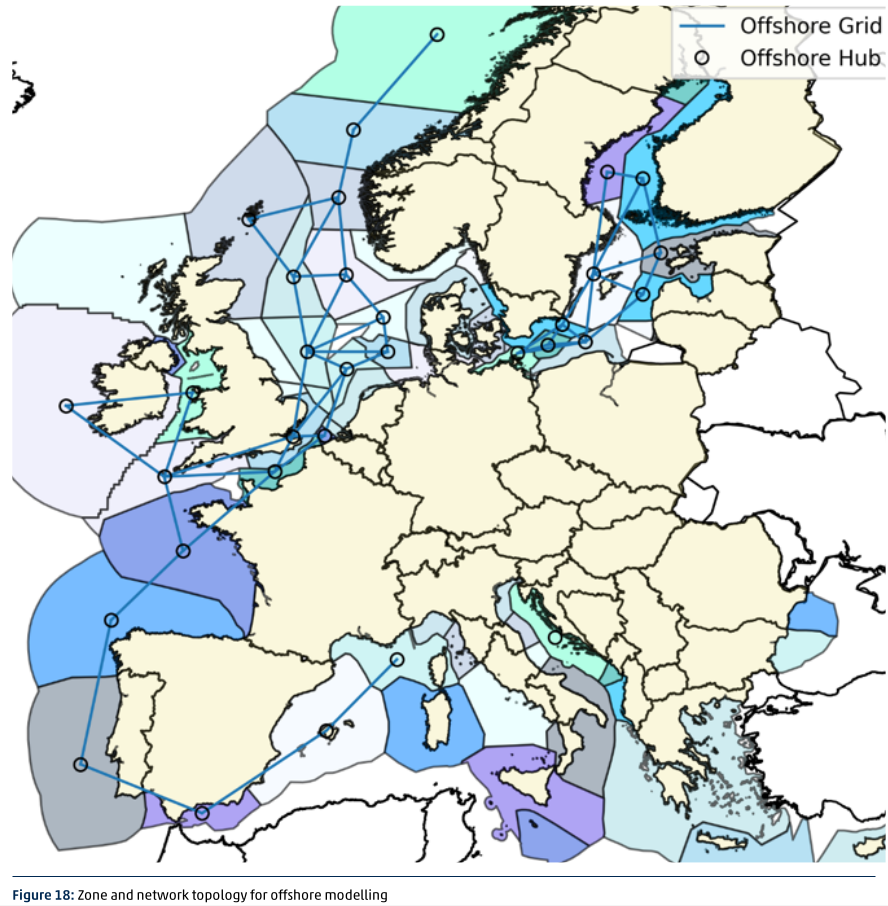
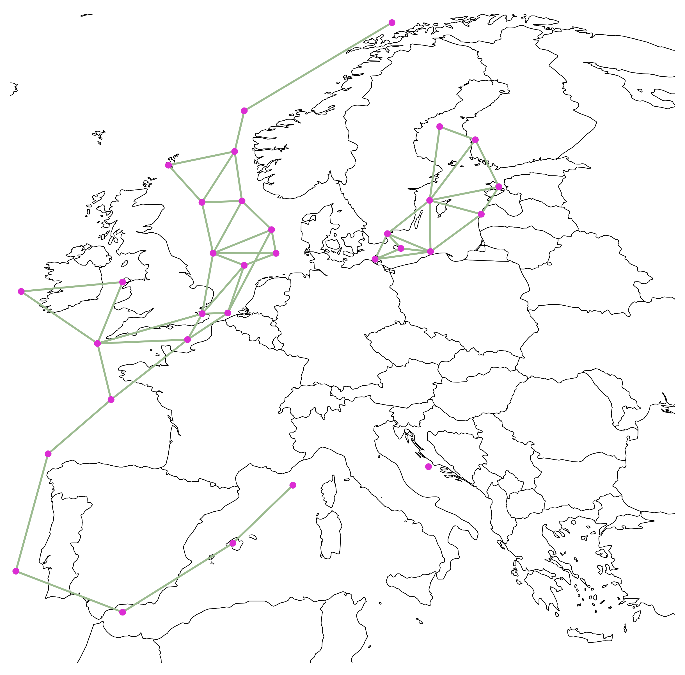

<!--
SPDX-FileCopyrightText: Contributors to Open-TYNDP <https://github.com/open-energy-transition/open-tyndp>
SPDX-FileCopyrightText: Contributors to PyPSA-Eur <https://github.com/pypsa/pypsa-eur>
SPDX-License-Identifier: CC-BY-4.0
-->

# Open-TYNDP: Interfacing Open Energy System Planning with ENTSO-E Models and Contributing to TYNDP

This repository introduces the open model dataset of the Open-TYNDP research and innovation project, which is a collaboration between [Open Energy Transition (OET)](https://openenergytransition.org/) and the European Network of Transmission System Operators for Electricity (ENTSO-E). The project’s aim is to explore and consider the adoption of PyPSA in the Ten-Year Network Development Plan (TYNDP) by building a workflow based on [PyPSA-Eur](https://github.com/pypsa/pypsa-eur). It seeks to complement the tools currently used in the TYNDP cycles, especially for Scenario Building (SB) and Cost-Benefit Analysis (CBA). This approach is designed to enhance transparency and lower barriers to stakeholder participation in European energy planning. Beyond Europe, the project aspires to demonstrate the viability of open-source (OS) frameworks in energy planning, encouraging broader global adoption.

To build trust in and ensure reproducibility with the new open-source toolchain, the project first focuses on replicating key figures from the 2024 TYNDP cycle, before aligning with the current 2026 TYNDP cycle. This process involves developing new features within the open-source domain to address existing gaps, integrating tools for data interoperability and dynamic visualizations, and publishing best practices to encourage the adoption of open energy models. Additionally, the project emphasizes stakeholder consultations and [interactive workshops](https://open-energy-transition.github.io/open-tyndp-workshops/intro.html) alongside the development of the PyPSA tool, further promoting collaboration and transparency throughout the process.

This repository is a soft-fork of [OET/PyPSA-Eur](https://github.com/open-energy-transition/pypsa-eur) and contains the entire project `Open-TYNDP` supported by OET, including code and documentation. The philosophy behind this repository is that no intermediary results are included, but all results are computed from raw data and code.

This repository is maintained using [OET's soft-fork strategy](https://open-energy-transition.github.io/handbook/docs/Engineering/SoftForkStrategy). OET's primary aim is to contribute as much as possible to the open-source upstream repositories. For long-term changes that cannot be directly merged upstream, the strategy organizes and maintains OET forks, ensuring they remain up-to-date and compatible with upstream on a regular basis, while also supporting future contributions back to the OS repositories.

# Development status

**WARNING**: Open-TYNDP is under active development and has several [Limitations](https://open-tyndp.readthedocs.io/en/latest/limitations.html) which you should understand before using the model. The model includes partial data from the TYNDP 2024 cycle, and its validation is ongoing. The github repository [issues](https://github.com/open-energy-transition/open-tyndp/issues) collect known topics we are working on (please feel free to help or make suggestions). The fact that this project relies on a soft-fork strategy implies that [upstream issues](https://github.com/PyPSA/PyPSA-Eur/issues) need to be addressed in the PyPSA-Eur repository. The [documentation](https://open-tyndp.readthedocs.io/) also remains work in progress.

The back-casting of the 2024 TYNDP cycle involves developing new features based on the published [modelling methodology report](https://2024.entsos-tyndp-scenarios.eu/wp-content/uploads/2025/01/TYNDP_2024_Scenarios_Methodology_Report_Final_Version_250128.pdf). Major and already implemented features are summarized below. Please, refer to the [Release Notes](https://open-tyndp.readthedocs.io/en/latest/release_notes.html) for a more comprehensive list of features and to the relevant [pull requests](https://github.com/open-energy-transition/open-tyndp/pulls?q=is%3Apr+label%3A%22major+feature%22) for extensive documentation of the implementations.

- Introduced a new electricity base network using TYNDP 2024 electricity reference grid data (see PR [#18](https://github.com/open-energy-transition/open-tyndp/pull/18)).
- Added option to use the TYNDP H2 topology including the TYNDP H2 reference grid, H2 Z1 and Z2 setup, production, reconversion and storage technologies (see PR [#17](https://github.com/open-energy-transition/open-tyndp/pull/17)).
- Added TYNDP hydrogen import potentials and corridors from outside of the modelled countries (see PR [#36](https://github.com/open-energy-transition/open-tyndp/pull/36)).
- Added the TYNDP electricity demand as an exogenously set demand (see PR [#14](https://github.com/open-energy-transition/open-tyndp/pull/14)).
- Added processing and preparation of TYNDP 2024 PECD v3.1 renewable profiles for offshore wind farms, replacing default ERA5-based profiles processed with Atlite (see PR [#53](https://github.com/open-energy-transition/open-tyndp/pull/53)).
- Introduced TYNDP offshore wind hubs topology with both electric and hydrogen infrastructure, offshore electrolysers, and detailed wind farm characteristics (see PR [#54](https://github.com/open-energy-transition/open-tyndp/pull/54)).

|       Feature        | TYNDP 2024 topology | Open-TYNDP topology |
|:--------------------:|:-------------------:|:-------------------:|
| **Electricity Grid** |  |  |
|  **Hydrogen Grid**   |  |  |
|  **Offshore Grid**   |  |  |

# Repository structure

* `benchmarks`: will store `snakemake` benchmarks (does not exist initially)
* `config`: configurations used in the study
* `cutouts`: will store raw weather data cutouts from `atlite` (does not exist initially)
* `data`: includes input data that is not produced by any `snakemake` rule
* `doc`: includes all files necessary to build the `readthedocs` documentation of PyPSA-Eur
* `envs`: includes all the `mamba` environment specifications to run the workflow
* `logs`: will store log files (does not exist initially)
* `notebooks`: includes all the `notebooks` used for ad-hoc analysis
* `report`: contains all files necessary to build the report; plots and result files are generated automatically
* `rules`: includes all the `snakemake`rules loaded in the `Snakefile`
* `resources`: will store intermediate results of the workflow which can be picked up again by subsequent rules (does not exist initially)
* `results`: will store the solved PyPSA network data, summary files and plots (does not exist initially)
* `scripts`: includes all the Python scripts executed by the `snakemake` rules to build the model

# Installation and Usage

## 1. Installation

Clone the repository:

    git clone https://github.com/open-energy-transition/open-tyndp

You need a package manager like [mamba](https://mamba.readthedocs.io/en/latest/) to run the analysis. Users may also prefer to use [micromamba](https://mamba.readthedocs.io/en/latest/installation/micromamba-installation.html) or [conda](https://docs.conda.io/projects/conda/en/latest/index.html). Using `mamba`, you can create an environment for `<your-os>` from within you can run it:

    mamba env create -n open-tyndp -f envs/<your-os>.lock.yaml

Activate the newly created `open-tydnp` environment:

    mamba activate open-tyndp

## 2. Run the analysis

    make tyndp

This will run all analysis steps to reproduce results and build the report.

To generate a PDF of the dependency graph of all steps `resources/dag_rulegraph.pdf` run:

    snakemake -c1 rulegraph --configfile config/config.tyndp.yaml

# Contributing and Support
We strongly welcome anyone interested in contributing to this project. If you have any ideas, suggestions or encounter problems, feel invited to file issues or make pull requests on GitHub.
-   To **discuss** with other PyPSA users, organise projects, share news, and get in touch with the community you can use the [Discord server](https://discord.gg/AnuJBk23FU).
-   For **bugs and feature requests**, please use the appropriate GitHub issues page. Issues specific to Open-TYNDP belong on the [Open-TYNDP Issues page](https://github.com/open-energy-transition/open-tyndp/issues), while PyPSA-Eur issues should be submitted to the [PyPSA-Eur Github Issues page](https://github.com/PyPSA/pypsa-eur/issues).

# Contact
For any questions about the Open-TYNDP or other queries, reach out via: <a href="mailto:tyndp@openenergytransition.org">tyndp@openenergytransition.org</a>.

Sign Up for the [project newsletter](https://openenergytransitionnewsletter.eo.page/tyndp-oet) for updates!

# Licence

Open-TYNDP is a soft-fork of PyPSA-Eur, relying on a similar licensing strategy. As with PyPSA-Eur, the code in Open-TYNDP is released as free software under the
[MIT License](https://opensource.org/licenses/MIT), see [`Licenses`](https://open-tyndp.readthedocs.io/en/latest/licenses.html) for attribution and licensing strategy details.
Additionally, different licenses and terms of use may apply to the various
input data, see [`Data Sources`](https://open-tyndp.readthedocs.io/en/latest/data_sources.html).