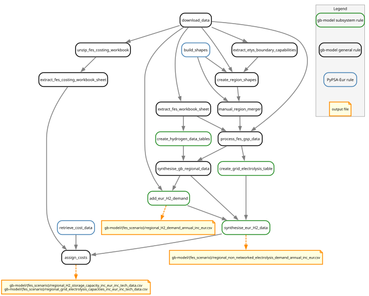

..
  SPDX-FileCopyrightText: Contributors to gb-dispatch-model <https://github.com/open-energy-transition/gb-dispatch-model>

  SPDX-License-Identifier: CC-BY-4.0

.. _hydrogen-overview:

##########################################
Hydrogen System
##########################################

This page describes the hydrogen subsystem, its data sources, components, configuration, and implementation.

Overview
========

The hydrogen subsystem in gb-dispatch-model represents the interaction between electricity and hydrogen systems in Great Britain and connected European countries.
Unlike other loads in the model which represent electrical demand from various sectors, hydrogen is modelled as a distinct energy carrier with its own bus, storage, and conversion technologies.

The hydrogen system comprises four main components:

- **Hydrogen demand**: Net hydrogen consumption for non-power system uses (e.g., industrial processes, hydrogen boilers, transport)
- **Grid-connected electrolysis**: Conversion of electricity to hydrogen via electrolysers connected to the electricity grid
- **Hydrogen storage**: Underground or surface storage for temporal balancing of hydrogen supply and demand
- **Hydrogen-to-electricity conversion**: Fuel cells and hydrogen turbines that can generate electricity from stored hydrogen

Additionally, the model accounts for *islanded electrolysis*—off-grid hydrogen production that appears only as additional electricity demand and does not interact with the modelled hydrogen system.

This modelling approach allows hydrogen to act as both a flexible load on the electricity system (through electrolysis) and a potential backup generation source (through fuel cells and turbines).

.. graphviz::

   digraph {
      rankdir=LR;
      node [shape=box, style=filled];

      // Main components
      AC_bus [label="AC Bus", fillcolor="#B3D9FF", shape=ellipse, width=2, height=1.5, fixedsize=true];
      H2_bus [label="H2 Bus", fillcolor="#CCFFFF", shape=ellipse, width=2, height=1.5, fixedsize=true];

      // Hydrogen system components
      electrolyser [label="Grid\nElectrolysis", fillcolor="#90EE90"];
      fuel_cell [label="Fuel Cell", fillcolor="#FFB6C1"];
      h2_turbine [label="H2 Turbine", fillcolor="#FFB6C1"];
      h2_store [label="H2 Storage", fillcolor="#FFFACD"];
      h2_demand [label="H2 Demand", fillcolor="#FFDAB9"];
      non_grid_elec [label="Non-networked\nElectrolysis", fillcolor="#DDA0DD"];

      // Connections
      AC_bus -> electrolyser -> H2_bus [label="Grid-connected"];
      H2_bus -> fuel_cell -> AC_bus;
      H2_bus -> h2_turbine -> AC_bus;
      H2_bus -> h2_store [dir=both];
      H2_bus -> h2_demand;
      AC_bus -> non_grid_elec [label="Off-grid demand"];
   }

.. _hydrogen-data-sources:

Data Sources
============

Great Britain Data
----------------------

All GB hydrogen system data is derived from the Future Energy Scenarios (FES) workbook, primarily from:

- **WS1 (Whole System)**: Annual hydrogen demand, supply, and storage capacity data filtered by fuel type, scenario pathway, and year
- **BB1 (Building Block Data)**: Regional grid-connected electrolysis capacities assigned to Grid Supply Points (GSPs)

The FES 2024 provides annual data for multiple scenarios (Electric Engagement, Hydrogen Evolution, Holistic Transition, Counterfactual, Five Year Forecast) covering:

- **Hydrogen production**: Grid-connected and islanded electrolysis capacities by region and year (in TWh/year and MW)
- **Hydrogen consumption**: Demand across different sectors (transport, heating, industry, power generation) in TWh/year
- **Hydrogen supply**: Non-electrolysis hydrogen sources (e.g., steam methane reforming with CCUS, biomass gasification, imports) in TWh/year
- **Storage capacity**: Required hydrogen storage infrastructure by year (in TWh)

All FES energy data is provided in TWh and converted to MWh for PyPSA (multiply by 1,000,000).

**European Data**
-----------------

For European countries outside GB, we synthesise hydrogen data by scaling GB patterns according to:

1. **TYNDP (Ten-Year Network Development Plan)**: Future hydrogen demand projections for European countries
2. **Hydrogen Europe annual report**: Current European hydrogen consumption by country

   - Data provided in tonnes per year (T/Y)
   - Converted to MWh using lower heating value: 1 tonne H₂ ≙  33.33 MWh

This synthesis approach maintains relative patterns from GB FES data (ratios between demand, storage, and electrolysis) while matching European-specific total demand projections.

.. _hydrogen-components:

System Components
=================

.. _hydrogen-demand:

Hydrogen Demand
---------------

**PyPSA Component**: ``Load`` attached to the hydrogen bus

Net hydrogen demand represents the total hydrogen consumption minus total hydrogen supply from all sources except grid electrolysis. Grid electrolysis is modelled separately and endogenously, so it does not appear in the supply data.

The hydrogen demand includes:

- Industrial processes (ammonia, steel, refining, chemicals)
- Residential and commercial building heating (hydrogen boilers)
- Road transport (hydrogen fuel cell vehicles)
- Rail transport (hydrogen trains)
- Shipping (hydrogen-fueled vessels)
- Aviation (hydrogen aircraft)
- Power generation (hydrogen fuel cells and turbines for electricity)

The demand is calculated as:

.. math::

   \text{Net H}_2 \text{ Demand} = \sum \text{All Demand} - \sum \text{All Unmodelled Supply}

where supply sources might include hydrogen from steam methane reforming, biomass gasification, or imports, but exclude grid electrolysis which is optimized by the model.

**Data Processing**:

The data processing pipeline extracts demand and supply data from FES WS1 sheet, filters by fuel type ("hydrogen"), scenario, and year range, then aggregates to create annual net demand in MWh.

**Temporal Profile**:

Hydrogen demand is assumed to be flat across the year.

**Regional Distribution**:

For GB, national hydrogen demand data is disaggregated to regions based on the spatial pattern of hydrogen electrolysis capacity from the FES BB1 sheet.
For European countries, demand is assigned at the country level based on TYNDP and historical consumption data.

.. _hydrogen-electrolysis:

Hydrogen Electrolysis
---------------------

Electrolysis converts electricity to hydrogen using water.

Grid-connected Electrolysis
^^^^^^^^^^^^^^^^^^^^^^^^^^^

**PyPSA Component**: ``Link`` from AC bus to hydrogen bus

Grid-connected electrolysers are directly connected to the electricity network and can be optimally dispatched in the model.
This provides flexibility to produce hydrogen when electricity is cheap or abundant (e.g., during high renewable generation periods).

**Capacity**:

Electrolyser capacities are extracted from the FES Building Block Data (BB1) for each GB region and year.
Where regional assignments are missing, capacities are distributed proportionally based on the existing regional distribution of electrolysis capacity.

**Efficiency**:

Electrolyser efficiency is derived from `PyPSA technology-data <https://github.com/PyPSA/technology-data>`_ (2035 cost year), representing the energy conversion from electricity to hydrogen (lower heating value basis).

**Operation**:

Grid-connected electrolysers are fully flexible with no minimum load constraints, meaning they can be dispatched at any level from 0% to 100% of capacity in any timestep.

.. _hydrogen-electrolysis-non-grid:

Non-networked Electrolysis
^^^^^^^^^^^^^^^^^^^^^^^^^^^

**PyPSA Component**: Additional electricity ``Load`` on the AC bus

Non-networked (or "off-grid") electrolysis represents hydrogen production from dedicated renewable generators that are not connected to the main electricity grid.
These could be remote wind farms or solar installations directly coupled to electrolysers.

From the electricity system perspective, this appears as an inflexible electricity demand.
The hydrogen produced does not appear in the model's hydrogen system but is accounted for in the supply side of the net hydrogen demand calculation.

**Calculation**:

Non-networked electrolysis electricity demand is calculated by dividing the hydrogen production capacity by an assumed electrolysis efficiency (configurable using config option ``fes.hydrogen.electrolysis_efficiency``, default 0.7):

.. math::

   \text{Electricity Demand} = \frac{\text{H}_2 \text{ Production}}{\text{Efficiency}}

For GB, this national electricity demand is disaggregated to regions based on the spatial pattern of hydrogen electrolysis capacity, then added to the baseline electricity load in each region.

.. _hydrogen-storage:

Hydrogen Storage
----------------

**PyPSA Component**: ``Store`` attached to the hydrogen bus

Hydrogen storage provides temporal flexibility to balance hydrogen production and demand.
Storage can be in underground caverns (salt caverns, depleted gas fields), surface tanks, or other infrastructure.

**Capacity**:

Storage capacity (energy capacity in MWh) is derived from FES data and increases over time as the hydrogen economy develops.
For GB, national storage capacity is disaggregated to regions based on the spatial pattern of hydrogen electrolysis capacity.
The model assumes that storage can be charged and discharged without capacity constraints beyond the bus energy balance (i.e., available hydrogen must be produced or drawn from storage).

**Dispatch Constraints**:

The storage level at the end of each modelled year is set equal to the level at the start of that year.
This cyclic constraint prevents unrealistic depletion of storage within each year, but may create artificial constraints on storage use in the final timesteps of each year (see :doc:`faq`).

.. _hydrogen-conversion:

Hydrogen to Electricity Conversion
-----------------------------------

Conversion of hydrogen back to electricity provides dispatchable backup generation that can support the grid during periods of low renewable generation or high demand.

.. _hydrogen-fuel-cells:

Fuel Cells
^^^^^^^^^^

**PyPSA Component**: ``Link`` from hydrogen bus to AC bus

Fuel cells convert hydrogen to electricity through an electrochemical reaction without combustion.

**Capacity**:

.. note::
   FES 2024 BB1 contains **zero fuel cell capacity for all years**.
   Fuel cells are not included in the FES hydrogen infrastructure projections.

.. _hydrogen-turbines:

Hydrogen Turbines
^^^^^^^^^^^^^^^^^

**PyPSA Component**: ``Link`` from hydrogen bus to AC bus

Hydrogen turbines are modified natural gas turbines that can burn pure hydrogen or hydrogen blends.
They combust hydrogen to drive a turbine and generate electricity.

**Capacity**:

Like fuel cells, hydrogen turbine capacity is based on FES projections.

.. _hydrogen-configuration:

Configuration
=============

The hydrogen subsystem is configured through the ``fes.hydrogen`` section of the configuration file.

**Data Selection**:

The data selection filters define which rows from the FES WS1 sheet are included in each category.
Filters are dictionaries matching FES column names to values (case-insensitive).

From ``config/config.gb.2024.yaml``:

.. literalinclude:: ../../config/config.gb.2024.yaml
   :language: yaml
   :lines: 906-938

.. _hydrogen-implementation-notes:

Implementation Notes
====================

**Data Processing Workflow**:

The hydrogen system is built through a multi-stage data processing pipeline implemented in ``rules/gb-model/hydrogen.smk``:

.. note::
   The graph above was generated using::

      pixi run filtered_rulegraph \
      "resources/GB/gb-model/HT/regional_H2_demand_annual_inc_eur.csv
      resources/GB/gb-model/HT/regional_non_networked_electrolysis_demand_annual_inc_eur.csv
      resources/GB/gb-model/HT/regional_H2_storage_capacity_inc_eur_inc_tech_data.csv
      resources/GB/gb-model/HT/regional_grid_electrolysis_capacities_inc_eur_inc_tech_data.csv" \
      "doc/gb-model/img/hydrogen_workflow.svg" \
      "-w fes_scenario -w year" \
      "-s 10,8" \
      "-f rules/gb-model/hydrogen.smk"

   The ``filtered_rulegraph`` task allows us to trim the full DAG to hydrogen-related rules only.

**Key Assumptions**:

- **Temporal Profile**: Hydrogen demand is assumed constant across the year due to lack of hourly data
- **Regionalization**: National hydrogen data is distributed spatially using hydrogen electrolysis capacity as a reference pattern
- **European Scaling**: European hydrogen infrastructure is synthesised by applying GB demand-to-infrastructure ratios
- **Off-grid Electrolysis**: Converted to electricity demand using configurable efficiency (``fes.hydrogen.electrolysis_efficiency``, default 0.7)
- **Technology Data**: Derived from PyPSA technology-data (2035 cost year) for all hydrogen components

.. seealso::

   **Related Documentation**:

   - :ref:`system-hydrogen` - Hydrogen in the broader system representation
   - :ref:`gb_data_sources` - FES and other data sources
   - :doc:`configuration` - Full configuration reference
   - :doc:`dispatch_redispatch` - Hydrogen in dispatch optimization

   **External Resources**:

   - `FES 2024 Data Workbook <https://www.neso.energy/publications/future-energy-scenarios-fes>`_ - Primary data source
   - `TYNDP 2024 <https://tyndp.entsoe.eu/>`_ - European hydrogen demand projections
   - `PyPSA technology-data <https://github.com/PyPSA/technology-data>`_ - Technology costs and parameters
