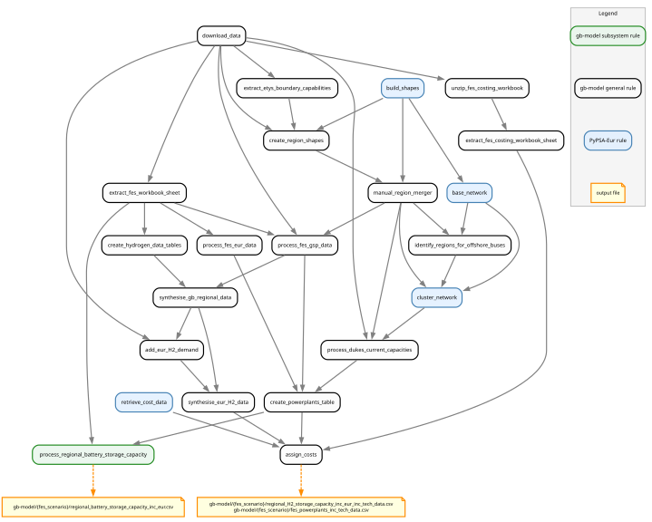

..
  SPDX-FileCopyrightText: Contributors to gb-dispatch-model <https://github.com/open-energy-transition/gb-dispatch-model>

  SPDX-License-Identifier: CC-BY-4.0

.. _storage-system:

##########################################
Storage System
##########################################

This page describes how electrical storage assets are represented in the model, including their data sources, capacity assignment, parameterisation, and implementation.

Overview
========

The model includes four types of storage assets:

- **Battery storage**: Grid-scale battery storage, sized by future FES scenarios
- **Pumped hydro storage (PHS)**: Gravity-based hydro reservoirs that can pump water uphill to store energy and generate on demand
- **Reservoir hydro**: Run-of-river and reservoir hydro modelled as storage units with ERA5-derived inflow time series
- **Hydrogen storage**: Storage capacity that buffers the hydrogen system — documented in :doc:`hydrogen_overview`

All storage assets are modelled as *fixed-capacity*, non-extendable units — the model dispatches within the capacities provided and does not invest in new storage.

.. _storage-data-sources:

Data Sources
============

The figure below gives a high-level view of the storage data pipeline:

.. graphviz::

   digraph {
      rankdir=LR;
      node [shape=box, style=filled];

      fes_flx1   [label="FES FLX1\n(battery e_nom)", fillcolor="#B3D9FF"];
      fes_bb1    [label="FES BB1\n(battery p_nom,\nPHS capacity)", fillcolor="#B3D9FF"];
      dukes      [label="DUKES 5.11\n(PHS existing caps)", fillcolor="#B3D9FF"];
      es2        [label="FES ES2\n(EUR battery p_nom)", fillcolor="#B3D9FF"];
      hydro_cap  [label="hydro_capacities.csv\n(PyPSA-Eur)", fillcolor="#B3D9FF"];

      ppl         [label="Powerplants table\n(carrier=battery,\ncarrier=PHS)", fillcolor="#FFFACD"];
      battery_csv [label="regional_battery_storage\n_capacity_inc_eur.csv\n(e_nom per region)", fillcolor="#FFFACD"];

      network [label="PyPSA Network\n(StorageUnits)", fillcolor="#90EE90", shape=ellipse];

      fes_bb1   -> ppl;
      dukes     -> ppl;
      es2       -> ppl;
      fes_flx1  -> battery_csv;
      ppl       -> battery_csv [label="p_nom\ndistribution"];
      ppl       -> network     [label="PHS p_nom\n(attach_hydro)"];
      battery_csv -> network   [label="battery e_nom\n(add_battery_storage)"];
      ppl       -> network     [label="battery p_nom\n(add_battery_storage)", style=dashed];
      hydro_cap -> network     [label="PHS e_nom\n(attach_hydro)"];
   }

FES FLX1 — Battery Energy Capacity
------------------------------------

Battery *energy* capacity (in GWh) for Great Britain is drawn from the NESO **Future Energy Scenarios (FES) 2024** workbook, sheet **FLX1 (Flexibility)**.

The relevant data item is identified by ``fes.gb.flexibility.carrier_mapping`` (see :ref:`storage-config`).

Values are provided per scenario and year and are converted from GWh to MWh (×1 000) before use.

FES BB1 — Battery Power Capacity and PHS Capacity
---------------------------------------------------

Battery *power* capacity (in GW) and PHS installed capacity (in GW) for Great Britain come from the **FES BB1 (Building Blocks)** sheet and the powerplants pipeline (see :doc:`generators`).

- ``carrier = "battery"``, ``set = "Store"`` entries in the powerplants table carry battery ``p_nom`` (MW).
- ``carrier = "PHS"``, ``set = "Store"`` entries carry PHS ``p_nom`` (MW).

Both are assigned through ``fes.gb.carrier_mapping`` / ``fes.gb.set_mapping``.

DUKES 5.11 — PHS Existing Infrastructure
------------------------------------------

The **Digest of UK Energy Statistics (DUKES) table 5.11** provides current PHS installed capacity and is used to anchor the spatial distribution of PHS plant where FES provides only Transmission Operator (TO) level data.

Carrier assignment from DUKES uses the ``dukes-5.11.carrier_mapping`` configuration section.

PyPSA-Eur — Hydro Capacities
------------------------------

Storage volume and inflow parameters for PHS and reservoir hydro are read from ``data/hydro_capacities.csv``.
The file provides per-country values for ``E_store[TWh]`` (reservoir energy capacity), ``p_nom_discharge[GW]``, ``p_nom_store[GW]``, and ``InflowHourlyAvg[GWh]``.

``attach_hydro`` uses ``E_store[TWh]`` to derive ``max_hours`` for reservoir hydro units whose value is missing or zero in the powerplants table.
For PHS, ``max_hours`` is taken directly from the powerplants table (defaulting to 6 hours if absent).

FES ES2 — European Capacity Data
----------------------------------

European battery power capacity (``p_nom``) is sourced from the **FES ES2** sheet of the FES 2024 workbook, which provides scenario-aligned capacity projections for European countries.
This sheet is processed by the ``process_fes_eur_data`` rule into ``national_eur_data.csv`` and merged into the powerplants table alongside the GB GSP-level data.

For European countries, battery energy capacity is then estimated by applying the GB mean energy-to-power ratio (:math:`e_\text{nom}/p_\text{nom}`) to the European battery ``p_nom`` from ES2.
PHS for European countries is handled entirely through the ``attach_hydro`` PyPSA-Eur function using ``hydro_capacities.csv``.

.. _storage-components:

System Components
=================

All three active storage types are modelled as PyPSA ``StorageUnit`` components.
Hydrogen storage is documented separately in :doc:`hydrogen_overview`.

.. list-table::
   :header-rows: 1
   :stub-columns: 1
   :widths: 20 26 27 27

   * - Attribute
     - Battery
     - PHS
     - Reservoir Hydro
   * - **Carrier**
     - ``battery``
     - ``PHS``
     - ``hydro``
   * - **p_nom source**
     - Powerplants table — FES BB1 (GB), FES ES2 (EUR)
     - Powerplants table — FES BB1 + DUKES (GB); ``hydro_capacities.csv`` (EUR)
     - Powerplants table — PyPSA-Eur powerplant database
   * - **e_nom / max_hours source**
     - FES FLX1 national total distributed by regional ``p_nom`` share (GB); GB mean ratio applied to EUR ``p_nom``
     - Powerplants table; defaults to 6 h when missing
     - Derived from ``E_store[TWh]`` in ``hydro_capacities.csv``, distributed across plants by ``p_nom`` share per country
   * - **Inflow time series**
     - —
     - — (no natural inflow assumed)
     - ERA5/runoff cutout, scaled by plant share of national ``p_nom``
   * - **Efficiency** (store / dispatch)
     - :math:`\sqrt{\eta}` / :math:`\sqrt{\eta}`
     - :math:`\sqrt{\eta_\text{PHS}}` / :math:`\sqrt{\eta_\text{PHS}}`
     - —
   * - **Bidirectional**
     - Yes
     - Yes — pumping (store) and generation (dispatch)
     - No — discharge only
   * - **cyclic_state_of_charge**
     - Yes
     - Yes
     - Yes
   * - **p_nom_extendable**
     - No
     - No
     - No

.. _storage-config:

Configuration
=============

Battery energy capacity data selection (``fes.gb.flexibility.carrier_mapping``):

.. literalinclude:: ../../config/config.gb.2024.yaml
   :language: yaml
   :start-after: # [doc:storage-battery-flx1-config-start]
   :end-before: # [doc:storage-battery-flx1-config-end]

Hydro carrier configuration:

.. literalinclude:: ../../config/config.gb.2024.yaml
   :language: yaml
   :start-after: # [doc:renewable-hydro-config-start]
   :end-before: # [doc:renewable-hydro-config-end]

Cost mappings for storage VOM (``fes_costs.fes_VOM_carrier_mapping``):

.. literalinclude:: ../../config/config.gb.2024.yaml
   :language: yaml
   :start-after: # [doc:fes-vom-config-start]
   :end-before: # [doc:fes-vom-config-end]

.. _storage-implementation:

Implementation Notes
====================

**Data Processing Workflow**:

The storage system is built through a pipeline implemented in ``rules/gb-model/storage.smk`` and integrated via the standard PyPSA-Eur ``attach_hydro`` function:

.. note::
   The graph above was generated using::

      pixi run filtered_rulegraph \
      "resources/GB/gb-model/HT/regional_battery_storage_capacity_inc_eur.csv
      resources/GB/gb-model/HT/regional_H2_storage_capacity_inc_eur_inc_tech_data.csv
      resources/GB/gb-model/HT/fes_powerplants_inc_tech_data.csv" \
      "doc/gb-model/img/storage_workflow.svg" \
      "-w fes_scenario -w year" \
      "-s 10,8" \
      "-f rules/gb-model/storage.smk"

   The ``filtered_rulegraph`` task allows us to trim the full DAG to storage-related rules only.

1. **FES FLX1 extraction** (``process_battery_energy_capacity``): Reads total GB battery energy capacity per scenario and year from FES FLX1; converts GWh to MWh
2. **Regional distribution** (``process_regional_battery_storage_capacity``): Distributes national battery ``e_nom`` to model regions in proportion to regional ``p_nom`` from the powerplants table; appends European regions using the GB mean ``e_nom``/``p_nom`` ratio
3. **Battery storage attachment** (``add_battery_storage`` in ``scripts/gb_model/compose_network.py``): Merges regional ``e_nom`` with the powerplants table on ``bus`` and ``year``, computes ``max_hours``, sets efficiency and cyclic state-of-charge, and adds each entry as a ``StorageUnit``
4. **PHS and hydro attachment** (``attach_hydro`` inside ``_integrate_renewables``): Reads ``p_nom`` for PHS and hydro from the powerplants table, sizes ``e_nom`` from ``data/hydro_capacities.csv``, and attaches inflow time series from the ERA5/runoff cutout in a single pass

**Key Assumptions**:

- **Regional battery distribution**: ``e_nom`` is allocated to regions strictly in proportion to their share of total GB battery ``p_nom``; regions with zero ``p_nom`` receive no energy capacity
- **European battery duration**: The GB mean ``e_nom``/``p_nom`` ratio is applied uniformly to all European battery entries; no country-specific duration data is used
- **Fixed capacity**: All storage assets are non-extendable (``p_nom_extendable = False``); the model dispatches within given capacities and cannot invest in new storage
- **Round-trip efficiency**: Cycle efficiency is split symmetrically between charging and discharging (:math:`\eta_\text{store} = \eta_\text{dispatch} = \sqrt{\eta}`)
- **PHS energy capacity**: Sized from PyPSA-Eur ERA5-derived ``hydro_capacities.csv``; no GB-specific reservoir volume data is used

.. seealso::

   **Related Documentation**:

   - :doc:`generators` - Powerplants pipeline that provides ``p_nom`` for battery and PHS
   - :doc:`hydrogen_overview` - Hydrogen storage (documented separately)
   - :doc:`configuration` - Full configuration reference
   - :doc:`dispatch_redispatch` - Storage dispatch in the optimisation

   **External Resources**:

   - `FES 2024 Data Workbook <https://www.neso.energy/publications/future-energy-scenarios-fes>`_ - Battery and PHS capacity projections
   - `DUKES table 5.11 <https://www.gov.uk/government/statistical-data-sets/dukes-chapter-5-electricity>`_ - Existing PHS installed capacity
   - `PyPSA-Eur <https://github.com/PyPSA/pypsa-eur>`_ - ``attach_hydro`` function and ERA5-derived hydro capacities
