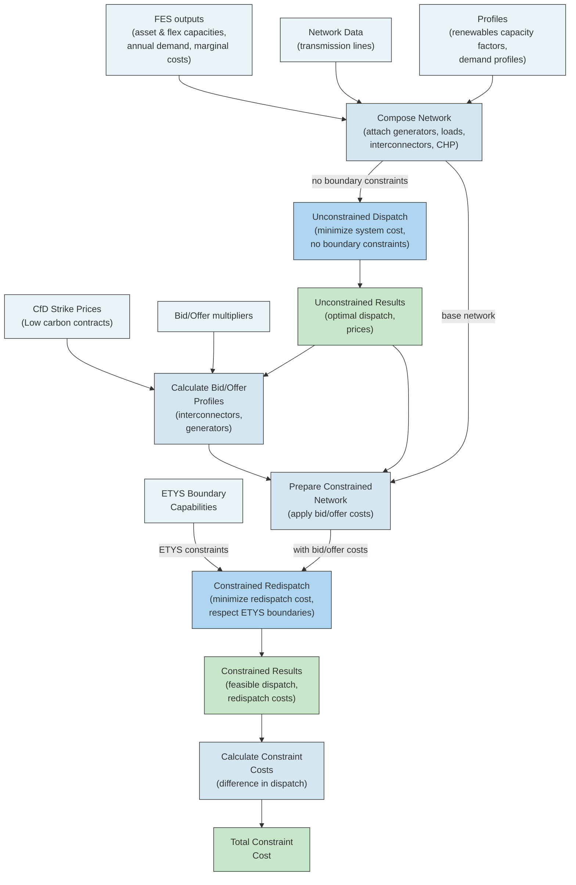
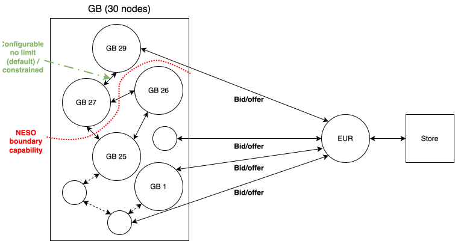
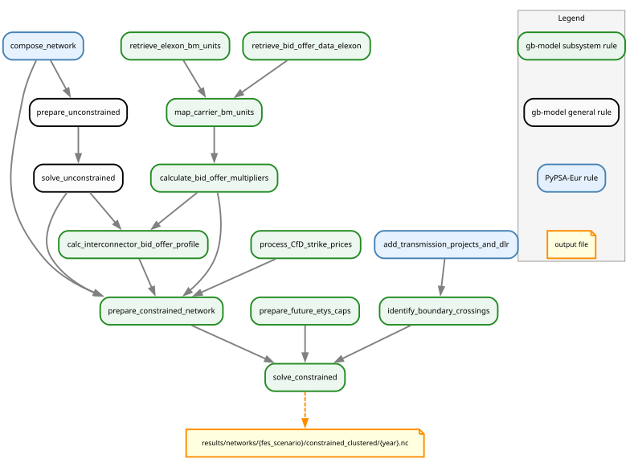

<!-- SPDX-FileCopyrightText: Contributors to gb-dispatch-model <https://github.com/open-energy-transition/gb-dispatch-model> -->
<!-- SPDX-License-Identifier: CC-BY-4.0 -->

# Dispatch and Redispatch Modelling {#system-dispatch_redispatch}

## Overview

The GB model implements a two-stage optimization approach to capture realistic electricity market operations and network constraints:

1. **Unconstrained Dispatch** - Optimal market dispatch without internal GB transmission constraints
2. **Constrained Redispatch** - Adjustments to respect internal GB transmission constraints with bid/offer costs

This approach reflects real GB electricity market operations where the initial, day-ahead market dispatch is followed by a balancing market to resolve transmission constraints.



## Process

### Stage 1: Unconstrained (day-ahead) dispatch

{: .full-width}

The unconstrained dispatch represents the economically optimal dispatch without considering internal GB transmission constraints.
By default, we optimise with a perfect foresight at an hourly resolution for individual years.

**Objective**: Minimize total system cost

$$
\min \sum_{t,g} MC_g \cdot p_{g,t} + \sum_{t,s} MC_s \cdot p_{s,t}
$$

Where:

- $MC_g$ - Marginal cost of generator g (GBP/MWh)
- $MC_s$ - Marginal cost of storage unit s (GBP/MWh)
- $p_{g,t}$ - Power output of generator g at time t
- $p_{s,t}$ - Power output of storage unit s at time t

**Constraints**:

- Supply-demand balance at each bus
- Generator capacity limits
- Minimum generation levels (e.g., heat-led CHP constraints)
- Interconnector flow limits
- Storage state of charge limits

Two changes to the default PyPSA-Eur constraints are made during the unconstrained dispatch stage:

1. We remove all line and link limits within the GB network and we remove Kirchhoff-Voltage-Law (linearised power flow) constraints throughout the entire network.
   We apply the first to "copperplate" the GB bidding zone (no transmission constraints between intra-GB regions).
   We apply the second to ensure all intra-GB regional market prices align in each time period.
2. We set upper and lower bounds on annual nuclear power capacity factors, to limit their dispatchability.
   The bounds can be found within the configuration file.

**Output**:

- Optimal dispatch schedule
- Nodal electricity prices
- Interconnector flows

### Stage 2: Constrained (balancing market) redispatch

{: .full-width}

The constrained redispatch modifies the unconstrained dispatch to respect ETYS (Electricity Ten Year Statement) boundary capabilities, as well as individual line limits of the GB high-voltage transmission network.
By default, we optimise with a perfect foresight at an hourly resolution for individual years.

**Key Modifications**:

1. **Fixed dispatch & redispatch generators**

   The initial dispatch profiles for generators, GB → neighbour interconnectors, and storage units are all fixed to their optimal values from stage 1.
   We also impose limits on intra-GB transmission using GB Electricity Ten-Year Statement (ETYS) boundary constraints, defined below.
   Generators (except nuclear power), interconnectors, and storage units can deviate from their optimal dispatch via virtual `up` and `down` generators that we create for each asset.
   `down` generators can only remove energy from the system, `up` generators can only add energy to it.
   To these virtual generators we then apply redispatch (bid/offer) costs.

   !!! note
       This process requires updates to core PyPSA-Eur storage constraints to (a) fix their optimal dispatch correctly and (b) include the virtual generators in the storage energy balance constraint.

2. **Bid/Offer Costs Applied**

   Generators that deviate from unconstrained dispatch incur bid (decrease) or offer (increase) costs based on technology-specific multipliers.
   The modified marginal cost becomes:

   $$
   MC'_g = \begin{cases}
   MC_g \times offer\_multiplier & \text{if increase from unconstrained} \\
   MC_g \times bid\_multiplier & \text{if decrease from unconstrained} \\
   \end{cases}
   $$

3. **ETYS Boundary Constraints**

   Transmission boundaries between ETYS regions are constrained to their capabilities:

   $$
   \sum_{line \in boundary} flow_{line} \leq capability_{boundary}
   $$

   Several transmission lines cross each boundary.
   Some lines cross several boundaries, such as offshore HVDC lines that connect northern Scotland with central England.
   The boundary capabilities are scaled in shoulder and summer seasons to reflect the impact of thermal limits on the lines crossing those boundaries.
   This scaling is configurable and based initially on values defined by NESO in table 2.3 of their [network options assessment methodology](https://www.neso.energy/document/285321/download).

   By default, transmission lines are not otherwise constrained to their individual physical capacities.
   This behaviour can be changed in the configuration so that individual transmission line capacities, as calculated by the PyPSA-Eur workflow, can *also* constrain intra-GB flows.

4. **Rest of Europe**

   At this stage, the operation of assets in the rest of Europe is fixed, with no scope for deviation.
   In fact, we don't care about distinguishing between European countries, we only care about the bid/offer costs on each interconnector with GB.
   We assume that GB can fully deviate from the use of these interconnectors as defined in the initial dispatch stage.
   That is, if it is exporting at full capacity in the optimal dispatch, it can feasibly redispatch to importing at full capacity.
   We assume that the rest of Europe can absorb this change without a change of redispatch costs along the interconnectors.

   Since we only care about the redispatch costs on the interconnectors, we simplify the rest of Europe at this stage to a single node with an infinite store that can inject/remove any quantity of energy from the system at zero additional cost.

**Objective**: Minimize redispatch cost

$$
\min \sum_{t,g} MC'_g \cdot (p_{g,t} - p^{unconstrained}_{g,t}) + RP \cdot |(p_{g,t} - p^{unconstrained}_{g,t})|
$$

Where:

- $RP$ - The [redispatch penalty cost](#system-redispatch-penalty).

### Bid/Offer Profile Calculation

!!! info "See also"
    For details on the different system components defined here, see: [System Overview](system_overview.md#system-overview_gb).

**Conventional Generators**

Multipliers are based on historical bids and offers.

For conventional assets (e.g., fossil-fuelled power plants), the bid cost is a premium minus the asset's short-run marginal cost.
This premium reflects a penalty paid by the system operator in lieu of profit lost by the asset operator.
The offer cost is the asset's short-run marginal cost plus a premium, to reflect additional profits gained in the balancing market.

**Low-Carbon Generators with Contracts for Difference**

For low-carbon generators with Contracts for Difference (CfD), the bid/offer costs are based on the strike price (the subsidy received by the operator) minus the asset short-run marginal cost.
This value is applied as a cost to the system whether the asset operator is increasing or decreasing output in redispatch.
It reflects a cost to the system operator to account for lost subsidy (bids) and to pay for additional generation (offers).

In rare cases, the strike price we have may be lower than our modelled short-run marginal costs.
For instance, if using wood pellet fuel prices for waste plants, their marginal costs exceed the strike price.
This highlights the problem of matching real, historical CfD data with modelled future costs.
In these cases, to mitigate strange model behaviour, we set the bid/offer costs to zero rather than allowing them to become negative.

**Other Generators & Storage Units**

Some system components have no historical bid/offer data, nor do we have subsidy information (e.g., geothermal plants, run-of-river hydropower).
For these plants, we do one of two things:

1. Directly map their short run marginal costs to their bid/offer costs.
   Therefore, when bidding, the system receives a revenue equal to the cost of generating that power.
2. Directly map a multiplier from another component

For storage units (pumped hydro and batteries), we *could* apply a multiplier (based on historical battery bid/offer costs).
However, storage redispatch costs are based on the opportunity cost of dispatching / storing energy in future time periods.
This opportunity cost is already reflected in the optimisation problem since it has perfect foresight for the model year.
Therefore, we set the storage redispatch costs to their short-run marginal costs (which are generally negligible).

**Demand-side response**

Demand-side response (DSR) can be redispatched and zero bid/offer costs are applied.
As with storage units, we assume DSR aggregators would be receiving revenue from capacity markets and so would not need additional payments in balancing markets.

**Interconnectors**:

Interconnector bid/offer costs are given as an hourly timeseries profile, derived from the unconstrained dispatch.
There are six options available to interconnectors during redispatch, as outlined in [the National Grid Long-term Market and Constraint Modelling methodology document](https://www.nationalgrid.com/sites/default/files/documents/Long-term%20Market%20and%20Network%20Constraint%20Modelling.pdf).

1. Currently importing into GB and offering to import more.
2. Currently importing into GB and bidding to import less or switch to exporting.
3. Currently not in use ("floating") and offering to import.
4. Currently not in use ("floating") and bidding to export.
5. Currently exporting from GB and offering to export less or switch to importing.
6. Currently exporting from GB and bidding to export more.

These can be collapsed into four profiles as we consider (1) & (3) and (4) & (6) to be equivalent.

- **Offering to increase imports**: Treated as generator offering power

  $$
  Cost_{offer}^{import+} = |\lambda_{GB} - \lambda_{neighbor}| + offer_{neighbor} \cdot (1 + \eta_{loss})
  $$

- **Bidding to decrease imports**: Treated as generator bidding to reduce

  $$
  Cost_{bid}^{import-} = \lambda_{GB} - \lambda_{neighbor} \cdot (1 + \eta_{loss}) - bid_{neighbor} \cdot (1 + \eta_{loss})
  $$

- **Offering to decrease exports**: Treated as generator offering power

  $$
  Cost_{offer}^{export-} = \lambda_{neighbor} \cdot (1 - \eta_{loss}) - \lambda_{GB} - offer_{neighbor} \cdot (1 - \eta_{loss})
  $$

- **Bidding to increase exports**: Treated as generator bidding to reduce

  $$
  Cost_{bid}^{export+} = |\lambda_{GB} - \lambda_{neighbor}| - bid_{neighbor} \cdot (1 - \eta_{loss})
  $$

Where:

- $\lambda_{GB}$ - GB marginal price (GBP/MWh)
- $\lambda_{neighbor}$ - Neighbor's marginal price (GBP/MWh)
- $offer_{neighbor}$ - Neighbor's marginal plant offer cost (GBP/MWh)
- $bid_{neighbor}$ - Neighbor's marginal plant bid cost (GBP/MWh)
- $\eta_{loss}$ - Interconnector loss rate (fraction)

The neighbours marginal plant is selected as the plant anywhere in Europe with marginal cost closest to the neighbour's marginal price.
This is because any plant could be setting the marginal price, via intra-European interconnectors.
The bid/offer costs of this plant are calculated as in GB, using the same multipliers.
However, since we do not have information on renewables subsidy mechanisms in each European country, if a low-carbon plant is setting the price, we do not set bids/offers to a strike price but rather to the plant's marginal cost.
This can mean that there are times with negligible bid/offer costs on the European side of the interconnector.

### Redispatch penalty {#system-redispatch-penalty}

The redispatch costs are sometimes formed in such a way that the system benefits financially from bidding off with one generator and bidding on with another an equal amount.
This happens in particular with interconnectors, in periods where it is cheaper to import more electricity than, say, ramp down a CCGT plant.
This is an optimisation quirk rather than reflection of how the balancing market operates.
In reality, overall redispatching is always kept to an absolute minimum.

To ensure we do not have excess redispatching in the optimisation, both bids and offers are penalised in the objective function.
This is a non-monetary penalisation that is added directly to the optimisation problem and is only used to mitigate this optimisation quirk;
PyPSA network statistics (e.g., `opex`, `revenue`, `market_value`) will not include this penalty.

The value of the penalty is configurable, to allow for it to be tweaked to be just large enough to mitigate excess redispatching but small enough not to cause numerical instability in the optimisation.

### Analysing results

Result files can be found in the `results` directory.
Each year in the horizon of interest is optimised separately and a file for each year is stored in the following directory structure:

```
results/{run}/networks/
├── unconstrained_clustered/              # Stage 1 results
│   └── {year}.nc
└── constrained_clustered/                # Stage 2 results
    └── {year}.nc
```

In addition, once all runs have completed, a `results/{run}/constraint_costs.csv` will be available, which gives a single value constraint cost for the entire modelling horizon, plus the final year's cost duplicated N times to simulate costs until the end of current infrastructure asset lifetimes.

## Configuration {#redispatch-configuration}

The workflow is configured under `redispatch` in the model configuration.

```yaml
{{ yaml_snippet("config.gb.2024.yaml", "doc:redispatch-start", "doc:redispatch-end") }}
```

## Implementation Notes {#redispatch-implementation-notes}

### Data Processing Workflow

The redispatch workflow is built through `rules/gb-model/redispatch.smk`.



!!! note
    The graph above was generated using:

    ```console
    pixi run filtered_rulegraph \
    "results/GB/networks/HT/constrained_clustered/2040.nc \
    -w fes_scenario -w year \
    -c compose_network \
    -f rules/gb-model/redispatch.smk -s 11,8" \
    "doc/gb-model/img/redispatch_workflow.svg"
    ```

    The `filtered_rulegraph` task allows us to trim the full DAG to the redispatch-related workflow slice while retaining the upstream steps that build the PyPSA network.

### Key Assumptions {#system-redispatch-assumptions}

- Storage is redispatched at the short-run marginal cost since the storage opportunity cost is reflected in the overall optimisation.
- Historical redispatch is suitable for defining bid/offer multipliers of conventional generators
- Historical low carbon contracts (e.g., CfDs) are suitable for defining future renewable energy bids/offers.
- Inverted bid/offer costs, caused by short-run marginal prices being higher than contracts subsidies for some low carbon generators, are not allowed; costs are instead set to zero.
- European renewable energy subsidy schemes are ignored when considering marginal generator bid/offer costs in interconnector redispatch cost calculations.
- Electrolyser and demand-side response load profiles can be adapted at zero cost in response to redispatched generation.
- Nuclear power is not able to redispatch due to ramping limitations.
- Renewable generators that were curtailed in the dispatch run may _increase_ there generation (bid on) during redispatch.
