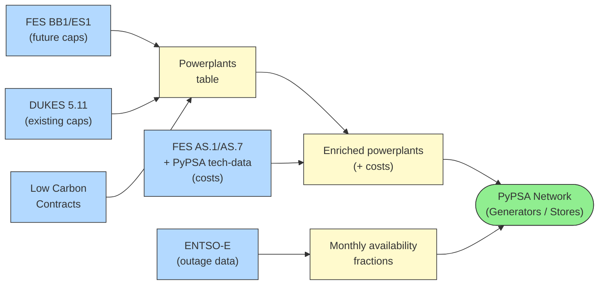
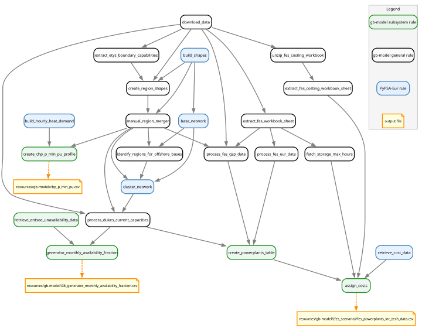

<!-- SPDX-FileCopyrightText: gb-dispatch-model contributors -->
<!-- SPDX-License-Identifier: CC-BY-4.0 -->

# Generation Components {#system-generators}

This page describes how generation assets are represented in the model, including their data sources, capacity assignment, cost parameterisation, availability modelling, and implementation.

## Overview

The generation system covers all electricity-producing assets connected to the modelled network, spanning both Great Britain and the surrounding European countries.
Generators are split into broad groups:

- **Conventional generators**: Thermal and nuclear plants (CCGT, OCGT, reciprocating engines, coal, nuclear, oil, waste, biomass, geothermal) that can be dispatched by the model within physical and contractual limits
- **Renewable generators**: Solar, onshore wind, and offshore wind, whose output is constrained by weather-derived capacity-factor time series
- **Hydrogen-to-electricity generators**: Fuel cells and hydrogen turbines — documented in [Hydrogen Subsystem](system_hydrogen.md)

A subset of conventional generators with heat-driven cogeneration duties are subject to different operating costs and efficiencies, and simplified *combined heat and power (CHP)* constraints that enforce minimum loading when heat demand is present.
Another subset of conventional generators with carbon capture and storage (CCS) capabilities are also subject to different operating costs.

All generators are modelled as *fixed-capacity*, non-extendable assets — the model dispatches within the capacities supplied and cannot invest in new plant.

## Data Sources {#generators-data-sources}

The figure below gives a high-level view of the generator data pipeline:



### FES BB1/ES1 — Future Capacity Projections

The primary source of *future* generator capacities for Great Britain is the NESO **Future Energy Scenarios (FES) 2024** workbook, sheets **BB1 (Building Blocks)** and **ES1 (Electricity supply data)**.

BB1 provides annual capacity projections disaggregated to Grid Supply Points (GSPs) for each FES scenario.
ES1 provides annual capacity projections for a greater disaggregation of technologies than given in BB1, also for each FES scenario.

The link between ES1 technologies and BB1 building blocks is configured in `fes.gb.building_block_mapping`.
The link between ES1 technologies and PyPSA network carrier names is configured in `fes.gb.carrier_mapping`.

### DUKES 5.11 — Existing Infrastructure

The **Digest of UK Energy Statistics (DUKES) table 5.11** provides a snapshot of *current* (2023) installed capacities for major power producers in Great Britain.
It is used to:

1. Anchor the spatial distribution of generators where FES does not provide GSP-level data, only Transmission Operator (TO) level data.
2. Provide current-year capacity baselines that are blended with FES future projections for the distribution step

Carrier assignment from DUKES uses the `dukes-5.11.carrier_mapping` and `dukes-5.11.set_mapping` configuration sections.

### ENTSO-E Transparency Platform — Outage Data

Historical generation unit unavailability data is retrieved from the **ENTSO-E Transparency Platform** (document type A77, "Unavailability of Generation Units") via its public API.
Data covers Great Britain over the period configured by `entsoe_unavailability.start_date` / `entsoe_unavailability.end_date` (default 2020–2024).

!!! note
    API access requires an `ENTSO_E_API_KEY` set in your `.env` file or shell environment.
    Register at https://transparency.entsoe.eu/ to obtain a key.

### FES Costing Workbook — Cost Data

Running costs (fuel and variable O&M) for GB generators are drawn from the **FES costing workbook**:

- **AS.1 (Power Generation costs)**: Variable O&M (VOM) and fuel costs per technology and year
- **AS.7 (Carbon Cost)**: CO₂ price trajectory used to compute marginal carbon costs

These data are combined with capital/fixed-cost parameters from **PyPSA technology-data** (costs at the configured planning horizon year, default 2035).

### PyPSA-Eur Powerplant Database

For **European** countries (outside GB), conventional generator capacities are sourced from the PyPSA-Eur powerplant matching pipeline, supplemented with FES European supply data (`fes.eur.carrier_mapping`).

### Low Carbon Contracts Register

The **Low Carbon Contracts Company (LCCC)** register of active Contracts for Difference (CfD) is used to identify additional renewable generator capacities (offshore wind, onshore wind, solar, biomass, waste) that may not yet be reflected in the FES or DUKES data.

## System Components {#generators-components}

### Conventional Generators {#generators-conventional}

**PyPSA Component**: `Generator` attached to the regional AC bus

Conventional generators include all thermal plant that can be freely dispatched up to their installed capacity.

The carriers modelled are:

| Carrier | Set options | Description |
|---|---|---|
| `CCGT` | PP/CHP/CCS | Combined-cycle gas turbine |
| `OCGT` | PP/CHP | Open-cycle gas turbine |
| `engine` | PP | Gas reciprocating engine |
| `nuclear` | PP | Nuclear (baseload) |
| `coal` | PP | Coal plant |
| `oil` | PP | Oil-fired plant |
| `waste` | PP/CHP | Waste incineration |
| `biomass` | PP/CHP/CCS | Biomass/bioenergy |
| `geothermal` | PP | Geothermal (minor capacity) |

Component names are the carrier names appended with their set name if it is **not** `PP`.
That is, gas CHP plants will be named `CCGT-CHP`; gas CCS plants `CCGT-CCS`; standard gas plants `CCGT`.

### Renewable Generators {#generators-renewables}

**PyPSA Component**: `Generator` with a time-varying `p_max_pu` profile

Renewable generators are capacity-constrained to an hourly capacity-factor time series derived from the atlite cutout and ERA5/SARAH reanalysis data via the standard PyPSA-Eur pipeline.

The renewable carriers are:

| Carrier | Notes |
|---|---|
| `solar` | Utility-scale and rooftop PV |
| `onwind` | Onshore wind |
| `offwind-dc` | Offshore wind (DC-connected) |
| `ror` | Run-of-River hydro (no storage reservoir) |

### Combined Heat and Power (CHP) {#generators-chp}

**PyPSA Component**: `Generator` with a time-varying `p_min_pu` profile

Many conventional carriers (CCGT, biomass, waste, etc.) exist in two variants: pure power plants and CHP units.
FES BB1 reports some technologies (e.g. "Biomass & Energy Crops (including CHP)", "Waste Incineration (including CHP)", "Non-renewable CHP") as including cogeneration.
FES ES1 reports the share of the CHP units and pure powerplants for each year for some of these technologies.
Based on the SubType of the technologies in ES1, which contain `CHP` as part of the naming, the mapping for the powerplants as `CHP` or `PP` is determined.
The resulting `set` column in the powerplants table therefore determines which fraction of each carrier is subject to CHP constraints — not the carrier itself.

From `config/config.gb.2024.yaml`:

```yaml
{{ yaml_snippet("config.gb.2024.yaml", "doc:fes-gb-set-mapping-start", "doc:fes-gb-set-mapping-end") }}
```

Rather than implementing full sector-coupling, the model applies a simplified *minimum loading* constraint based on local heat demand to the CHP subset.

The `p_min_pu` profile for each CHP generator is derived from the normalised hourly heat demand of the model region it serves:

$$
p_\text{min,pu}(t) =
\begin{cases}
  0 & \text{if } \hat{q}(t) < \delta_\text{shutdown} \\
  \max\!\left(\dfrac{\hat{q}(t)}{c_b},\ p_\text{min}\right) & \text{otherwise}
\end{cases}
$$

where:

- $\hat{q}(t)$ — normalised heat demand (fraction of annual peak) at time *t*
- $c_b$ — heat-to-power ratio (`chp.heat_to_power_ratio`, default 1.5)
- $p_\text{min}$ — minimum operation level when running (`chp.min_operation_level`, default 0.3)
- $\delta_\text{shutdown}$ — heat demand threshold below which the CHP may shut down completely (`chp.shutdown_threshold`, default 0.1)

Heat demand $\hat{q}(t)$ is computed by summing all four sectoral components—residential space, residential water, services space, services water—from the PyPSA-Eur `hourly_heat_demand_total_base_s_clustered.nc` dataset, then normalising by the annual peak.

This ensures CHPs run at least enough to cover heat demand, without modelling a separate heat bus.
CHP constraints can be disabled entirely via `chp.enable: false`, in which case the plants are treated as unconstrained conventional generators.

## Availability Modelling {#generators-availability}

Monthly availability fractions are computed for GB thermal generators using ENTSO-E outage data.
The pipeline:

1. **Retrieves** planned and forced outage records from the ENTSO-E API by time period (chunked to stay within API rate limits)
2. **Filters** outages that exceed `entsoe_unavailability.max_unavailable_days` (default 366 days), treating very long outages as effectively retired plant rather than temporary unavailability
3. **Accumulates** unavailable MW on a 1-minute resolution time series for each carrier, then takes the monthly mean
4. **Calculates** availability fractions as:

$$
a_m = \frac{C_\text{total} - \overline{U}_m}{C_\text{total}}
$$

where $C_\text{total}$ is the total installed capacity for a carrier (from DUKES) and $\overline{U}_m$ is the mean unavailable capacity in month *m*.

The resulting monthly profile is applied uniformly across all generators of the same carrier for the simulated year, scaling their effective `p_nom`.
This is also applied to European neighbouring countries by default unless explicitly de-selected (`entsoe_unavailability.extend_to_eur_regions`).

## Cost Assignment {#generators-costs}

Each generator in the powerplants table is enriched with cost and technical parameters through a multi-source lookup:

1. **FES AS.1**: Provides year-specific fuel costs and VOM for GB-relevant technologies; averaged across scenarios because scenario names change between FES editions
2. **FES AS.7**: Provides year-specific carbon price (£/tCO₂); averaged across scenarios
3. **PyPSA technology-data**: Provides efficiency and CO₂ intensity (tCO₂/kWh) for technologies, since this data is absent from the FES workbooks.
4. **Default characteristics**: Fallbacks defined in `fes_costs.pypsa_eur_tech_data_defaults` ensure all PyPSA-Eur technology data exist even when data is missing.

Marginal costs are assembled as:

$$
c_\text{marginal} = c_\text{CO2} \cdot I_\text{CO2} \cdot \frac{c_\text{fuel}}{\eta} + c_\text{VOM}
$$

where $\eta$ is efficiency, $c_\text{fuel}$ thermal price, $c_\text{VOM}$ variable O&M, $c_\text{CO2}$ carbon price, and $I_\text{CO2}$ the CO₂ intensity.

## Configuration {#generators-configuration}

The below configuration snippets are based on the content of `config/config.gb.2024.yaml`.

### Carrier and Set Definitions

The carriers included in the model and how they are treated (conventional vs renewable, generator vs store) are controlled by:

```yaml
{{ yaml_snippet("config.gb.2024.yaml", "doc:electricity-config-start", "doc:electricity-config-end") }}
```

FES technology to PyPSA network carrier mapping (GB):

```yaml
{{ yaml_snippet("config.gb.2024.yaml", "doc:gb-generator-storage-start", "doc:gb-generator-storage-end", prepend="fes.gb:") }}
```

FES technology to PyPSA network carrier mapping (EUR):

```yaml
{{ yaml_snippet("config.gb.2024.yaml", "doc:eur-generator-storage-start", "doc:eur-generator-storage-end", prepend="fes.eur:") }}
```

!!! note
    We use the dot notation for parent configuration keys.
    For example, `fes.gb` is equivalent to `fes` as the top-level key, `gb` as the first-level key, then the configuration snippet is at the level below this.

### CHP Constraints

```yaml
{{ yaml_snippet("config.gb.2024.yaml", "doc:chp-config-start", "doc:chp-config-end") }}
```

### ENTSO-E Unavailability

```yaml
{{ yaml_snippet("config.gb.2024.yaml", "doc:entsoe-unavailability-config-start", "doc:entsoe-unavailability-config-end") }}
```

## Implementation Notes {#generators-implementation-notes}

### Data Processing Workflow

The generator system is built through a pipeline implemented in `rules/gb-model/generators.smk`:



!!! note
    The graph above was generated using:

    ```console
    pixi run filtered_rulegraph \
    "resources/GB/gb-model/HT/fes_powerplants_inc_tech_data.csv \
    resources/GB/gb-model/GB_generator_monthly_availability_fraction.csv \
    resources/GB/gb-model/chp_p_min_pu.csv \
    -w fes_scenario -w year \
    -f rules/gb-model/generators.smk \
    -s 10,8" \
    "doc/gb-model/img/generators_workflow.svg"
    ```

    The `filtered_rulegraph` task allows us to trim the full DAG to generator-related rules only.

1. **Retrieve outage data** (`retrieve_entsoe_unavailability_data`): Fetches ENTSO-E unavailability records for GB over the configured date range, chunked to respect API limits
2. **Monthly availability fractions** (`generator_monthly_availability_fraction`): Combines outage records with DUKES capacity baselines to produce per-carrier, per-month availability fractions
3. **Powerplants table** (`create_powerplants_table`): Assembles GSP-level capacity table from FES BB1 (future), DUKES (existing), and European supply data; handles both direct GSP-level data and distribution from Transmission Owner (TO) regional totals
4. **Cost assignment** (`assign_costs`): Enriches the powerplants table with operating costs and technical parameters.
5. **CHP minimum operation profile** (`create_chp_p_min_pu_profile`): Derives the hourly `p_min_pu` time series for CHP generators from the aggregated heat demand dataset

**Network Assembly via PyPSA-Eur Methods**:

The artefacts produced by `generators.smk` are consumed by the `compose_network` rule (`rules/gb-model.smk`), which assembles the final PyPSA network.
In addition to the generator-specific outputs above, `compose_network` also receives several standard PyPSA-Eur inputs:

- **Renewable capacity-factor profiles** (`profile_{tech}_clustered.nc`): Hourly `p_max_pu` time series for solar, onshore wind, offshore wind, and hydro, produced by the atlite cutout pipeline from ERA5/SARAH reanalysis data.
- **Technology costs CSV** (`costs_{year}.csv`): The PyPSA technology-data cost table for the planning horizon year, used here only because we have to pass it through to standard PyPSA-Eur methods when attaching some generators.

Rather than reimplementing generator attachment logic, `compose_network` calls PyPSA-Eur's standard functions from `scripts/add_electricity.py` directly:

- `attach_conventional_generators` — adds thermal and nuclear `Generator` components from the enriched powerplants table
- `attach_hydro` — adds hydro `Generator` and `StorageUnit` components (including PHS) using the capacity-factor profiles and hydro capacities file
- `attach_wind_and_solar` (local wrapper) — adds renewable `Generator` components with time-varying `p_max_pu` from the clustered profiles

This reuse of upstream PyPSA-Eur methods ensures that the GB model stays consistent with the broader PyPSA-Eur network representation while layering GB-specific capacity data, costs, and availability fractions on top.

**Capacity Distribution**:

When FES supplies only TO-level (Transmission Owner region) totals rather than GSP-level data, capacities are distributed to GSPs using a four-step hierarchy:

1. GSP-level FES data for the same carrier and year
2. GSP-level DUKES data for the same carrier
3. GSP-level FES + DUKES data for *all* carriers combined
4. Overall national distribution as a fallback

This hierarchy preserves known regional concentrations (e.g., offshore wind clusters near specific GSPs) while gracefully handling carriers with no fine-grained spatial data.

### Key Assumptions {#system-generators-assumptions}

- **No capacity expansion**: All generator capacities are fixed at the FES scenario projections for the modelled year; the optimiser dispatches within these limits
- **Uniform availability**: Monthly availability fractions are applied uniformly to all generators of the same carrier across all GB regions
- **CHP heat coupling**: CHPs are constrained to run above a heat-demand-derived floor but are not connected to a separate heat bus; heat demand is satisfied exogenously
- **Cost averaging**: FES fuel and VOM costs are averaged across scenarios due to naming changes between FES editions; this has a small effect (≤ ~10% for battery VOM) on marginal costs
- **Infinite fuel supply**: Fuel feedstocks (gas, coal, oil, biomass, etc.) are assumed to be available in unlimited quantities at the modelled marginal cost; no supply constraints or fuel capacity limits are enforced
- **European generators**: European countries use the PyPSA-Eur conventional generator database; availability fractions are applied outside GB by default (disable via `entsoe_unavailability.extend_to_eur_regions`), but CHP constraints are not applied outside GB

!!! info "See also"
    **Related Documentation**:

    - [Hydrogen to Electricity Conversion](system_hydrogen.md#hydrogen-conversion) - Hydrogen-to-electricity generators (fuel cells and turbines)
    - [Dispatch and Redispatch Modelling](system_dispatch_redispatch.md) - How generators are dispatched in the optimisation
    - [Configuration](configuration.md#model_config_gb) - Full configuration reference

    **External Resources**:

    - [FES 2024 Data Workbook](https://www.neso.energy/publications/future-energy-scenarios-fes) - Primary capacity data source
    - [DUKES 5.11](https://www.gov.uk/government/statistics/electricity-chapter-5-digest-of-united-kingdom-energy-statistics-dukes) - Existing installed capacity
    - [ENTSO-E Transparency Platform](https://transparency.entsoe.eu/) - Outage data API
    - [PyPSA technology-data](https://github.com/PyPSA/technology-data) - Technology costs and parameters
    - [Low Carbon Contracts Company](https://www.lowcarboncontracts.uk/) - CfD generation register
