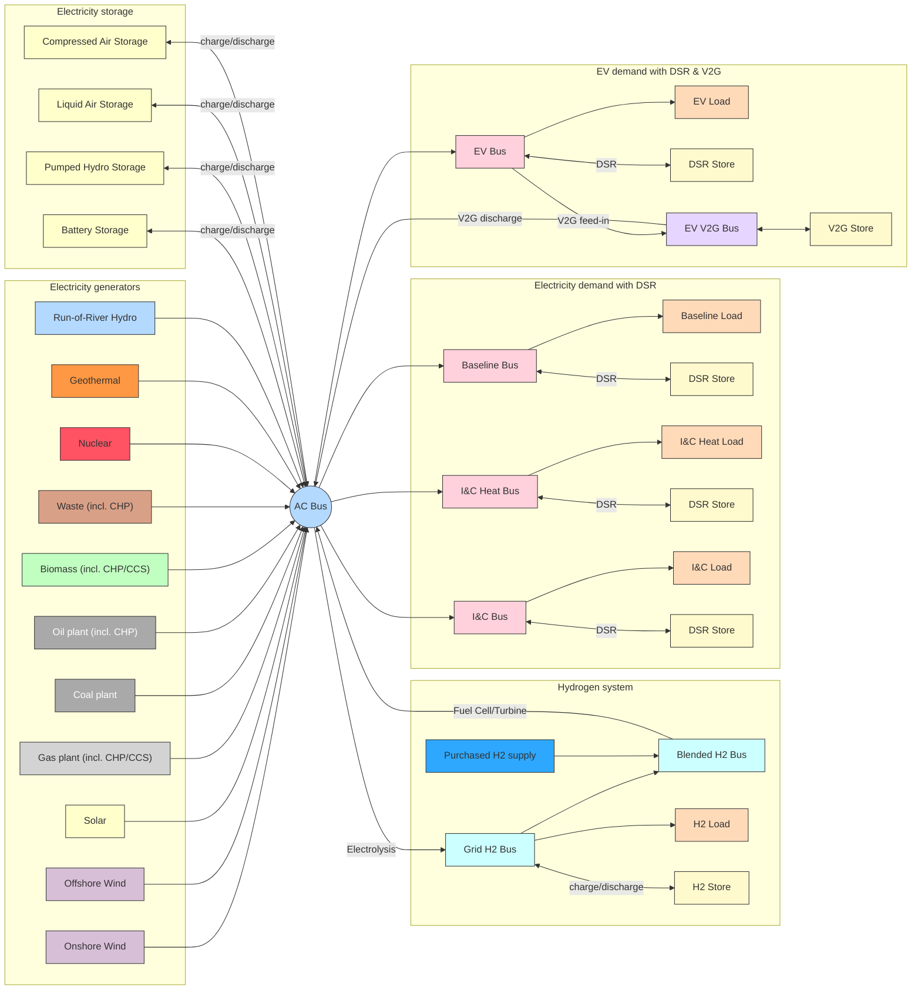

<!-- SPDX-FileCopyrightText: Contributors to PyPSA-Eur <https://github.com/pypsa/pypsa-eur> -->
<!-- SPDX-FileCopyrightText: Contributors to gb-dispatch-model -->
<!-- SPDX-License-Identifier: CC-BY-4.0 -->

# System Overview {#system-overview_gb}

We represent the GB model in PyPSA as follows:

!!! note
    The extent of the system and the components defined within it represent the system as defined by the NESO FES and are subsets of what is available in PyPSA-Eur.
    It is unlikely that our representation is a direct match for the FES model and we have not attempted to create a mirror copy (a feat that would be infeasible with the limited data available).
    Instead, we aim to see similar system dynamics when answering questions with the model.

## Geographic system representation {#system-geographic}

A bus is a subnational region in Great Britain and national regions in other European countries.
Only those European countries defined by the NESO FES are included, which includes connected neighbours (e.g., France, Norway) and other that are further afield (e.g., Italy, Slovenia, Portugal).
This equates to only a subset of countries available in PyPSA-Eur.
For instance, Balkan countries are not represented in the NESO FES European dataset.

Ireland is a special case as the Republic of Ireland and Northern Ireland are (part of) different countries but are considered as a single market zone by NESO.
Therefore, our modelled Ireland bus covers the whole island.

## System components {#system-components}

The GB dispatch model only represents the power system.
It is, however, a multi-sector model in that building heat, transport, and hydrogen loads are defined.
We just concern ourselves with the electrical component of those sectors (heat pumps / resistive heating, electric vehicles, electrolysis).

### Generators {#system-generators-summary}

Our system contains variable renewable, conventional dispatchable, and combined heat and power (CHP) generators.

!!! info "See also"
    [Generation Components](system_generators.md)

#### Variable renewables

We represent four types of variable renewable generators: onshore wind (`onwind`), offshore wind (`offwind`), solar photovoltaic (PV) panels (`solar`), and reservoir / run-of-river hydropower (`hydro` / `ror`).
For each, we simulate a time-varying capacity factor curve which represents the availability of the natural resource with which they are powered (wind, sun, water flow).
These curves are based on historical, global or European weather reanalyses (ERA5 / SARAH) and exogenous generator parameterisation (e.g. defining the wind turbine height).

We do not distinguish between technology options within each of our broad generator groups.
For instance, we ignore differences in solar PV orientation and pitch and assume they would be at the optimal for both.
This is a reasonable assumption for open field solar but not for rooftop solar, where there is limited availability for optimal placement due to existing roof structures.

We also do not distinguish between generators within geographic regions.
This means that performance variations are averaged across all reanalysis gridcells in a region, ignoring those gridcells with land-use constraints.
Within the smaller GB sub-regions, the geographic variation is likely to be small.
In European countries, the difference over which we are averaging may be very large, particularly for long and thin countries (e.g. Italy) or those with complex orography (e.g. Switzerland).

!!! note
    In addition to these technologies, wave and tidal energy are defined in the FES.
    Since we lack sufficient data to define their capacity factor profiles, these technologies are not yet defined in the model.

#### Other low- / zero-carbon generators

Alongside variable renewable generators, we define some conventional and novel low-/zero-carbon generators: nuclear power plants (`nuclear`), biomass power plants (`biomass`), waste incinerators (`waste`), and geothermal power plants (`geothermal`).
Nuclear power plants have a relatively rigid operating schedule to emulate their limited dispatchability.
All other plant types are fully dispatchable and we assume no carbon emissions (for the purpose of applying carbon costs).

#### Dispatchable carbon emitting generators

We represent several conventional, carbon-emitting generators that can dispatch without constraints: coal (`coal`), gas (`CCGT` / `OCGT` / `engine`), and oil (`oil`) fired power stations.
Where information on the type of plant is available, we define technology subsets.
This is the case for natural gas plants, for which we define combined- and open-cycle gas turbines and reciprocating engines.

As with the other low carbon generators, these plants are fully dispatchable.
In addition, we apply a cost of carbon to the fuel they consume, which is included in their total marginal cost.

#### Combined heat and power

Some generators are combined heat and power (CHP) plants.
This means their generation profile can be limited by meeting separate heating requirements (if heat-led).
These generators are tagged separately based on input data and have an additional constraint applied to reflect their link to the heat system.

### Storage {#system-storage-summary}

There are five primary energy storage technologies defined in the model: pumped hydropower (`PHS`), utility-scale batteries (`battery`), liquid-/compressed-air storage (`liquid-air` / `compressed-air`) and hydrogen storage.
Pumped hydropower and batteries have a maximum number of hours they can store energy for which, when combined with their discharge/charge capacity, defines their reservoir capacity.

!!! info "See also"
    [Hydrogen Subsystem](system_hydrogen.md), [Storage Components](system_storage.md)

### Loads {#system-load-summary}

Although all loads are electricity loads, we have grouped them to allow us to apply different magnitudes of demand-side response.

!!! info "See also"
    [Baseline demand & demand-side response (DSR)](system_demand_and_dsr.md), [Heat System](system_heat.md)

#### Baseline electricity {#system-load-baseline-summary}

Baseline electricity demand is equivalent to all sources of electricity consumption in the current energy system.
For instance, lighting, appliances, cooling.
The profile for this load is the same as the profile for the load in the reference weather year, so that the impact of weather is represented (e.g. for cooling demand).

By default, FES baseline electricity demand also includes resistive heating electricity demand.
We extract this demand and include it instead in the [building heat electricity lead profile](#system-load-heat-summary).

#### Building heat {#system-load-heat-summary}

Residential and Industry & Commercial (I&C) building heat demand is considered separately.
Since we are only concerned with the electricity system, this load represents the electricity demand to operate technologies that generate heat.
Importantly, this is building heat load met by heat pumps **and** direct (resistive) heaters.

For countries which have been reliant on electricity for many years already (e.g. France, Norway and Sweden), the reference weather year [Baseline electricity](#system-load-baseline-summary) profile would include the seasonal effect of heat pumps already.
To ensure we do not double-count this seasonal effect in both load profiles, we remove a simulated historical heat pump load from the historical baseline electricity load profile.
This means that only this "building heat" load has that profile shape, whereas the baseline electricity profile should not reflect building heat seasonality at all.

#### Additional demand {#system-load-additional-summary}

Our GB demands are based on those defined at each grid supply point (GSP).
There are several other demands that are not geographically distributed in the published FES workbook but that need to be accounted for in the model.
We capture these as the additional demand above that which is defined at the GSPs and apply it as a static, baseload demand.
We distribute it according to the relative magnitude of GSP-based demand in each model region.

Furthermore, there are transmission and distribution (T&D) losses in the FES  workbook that add to the effective system electricity demand.
We distribute these losses to GB regions and to each hour of the year in proportion to the relative demand in that region and hour.

#### Demand-side response {#system-load-dsr-summary}

Each load has some flexibility in when it can be met.
This is represented using a demand-side response (DSR) component which can shift energy in time.
The size of this DSR component is based on the peak shaving capability of flexibility (time-of-use tariffs, heat storage, etc.) according to the FES.
The number of hours in the day in which it can shift load has been assumed and is user-configurable.

### Subsystems {#system-subsystem-summary}

#### Electric vehicles (EVs) {#system-ev-summary}

Electric vehicles are represented in a similar fashion to other [loads](#system-load-summary).
The DSR component of EVs is a virtual store that does not represent actual vehicles.
Instead, we have an "unmanaged" component of EV load (a simulation of the load profile if EV owners charged at full capacity when they wanted) which can be buffered by a DSR component.
The magnitude of DSR capacity varies in time depending on the number of vehicles that we simulate as being parked.

In addition to the standard load components, it is also possible for EVs to feed back to the grid using a vehicle-to-grid (V2G) component.
This allows energy to be stored by EVs for later return to the grid.

For detailed information about the EV system components, data sources, and implementation, see [Electric Vehicle Subsystem](system_ev.md).

!!! info "See also"
    [Electric Vehicle Subsystem](system_ev.md)

#### Hydrogen {#system-hydrogen-summary}

Hydrogen load is the only non-electrical load defined in the system.
Within the hydrogen subsystem is a static load, required for non-power system uses (e.g. hydrogen boilers, hydrogen in industry), a hydrogen storage device, and converters from and to electricity.
To create hydrogen from electricity, an electrolyser is used.
To create electricity from hydrogen, a fuel cell or hydrogen gas turbine can be used.

!!! info "See also"
    [Hydrogen Subsystem](system_hydrogen.md)
