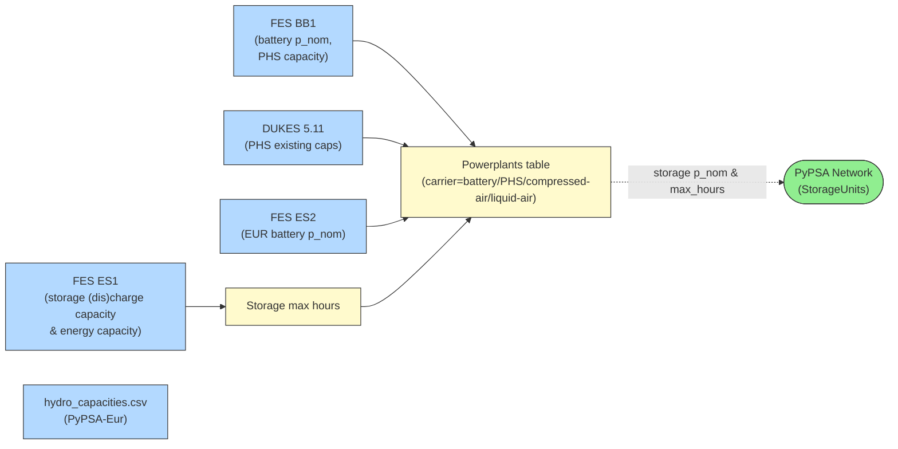

<!-- SPDX-FileCopyrightText: gb-dispatch-model contributors -->
<!-- SPDX-License-Identifier: CC-BY-4.0 -->

# Storage Components {#system-storage}

This page describes how electrical storage assets are represented in the model, including their data sources, capacity assignment, parameterisation, and implementation.

## Overview

The model includes the following storage assets, sized by future FES scenarios:

- **Battery storage**: Grid-connected battery storage
- **Pumped hydro storage (PHS)**: Gravity-based hydro reservoirs that can pump water uphill to store energy and generate on demand
- **Compressed (CAES) & liquid (LAES) air storage**: Grid-connected compression storage, usually stored in large underground caverns or tanks
- **Hydrogen storage**: Storage capacity that buffers the hydrogen system — documented in [Hydrogen Subsystem](system_hydrogen.md)

All storage assets are modelled as *fixed-capacity*, non-extendable units — the model dispatches within the capacities provided and does not invest in new storage.

## Data Sources {#storage-data-sources}

The figure below gives a high-level view of the storage data pipeline:



### FES ES1 — Storage Max Hours

Storage *(dis)charge* (`p_nom`, in MW) and *energy* capacity (`e_nom`, in GWh) for Great Britain is drawn from the NESO **Future Energy Scenarios (FES) 2024** workbook, sheet **ES1 (Electricity supply)**.

Together, these can be used to define the maximum number of hours that a storage vessel could discharge for: $\text{max\_hours} = e_\text{nom}/p_\text{nom}$.

This is then used in defining the technologies in PyPSA since `StorageUnit` component energy capacity is defined by its `max_hours`.

The max hours of a storage technology is assumed to be the same in all model regions.

### FES BB1 — Regional Discharge Capacity

Regional *(dis)charge* capacity (in GW) for Great Britain comes from the **FES BB1 (Building Blocks)** sheet and the powerplants pipeline (see [Generation Components](system_generators.md)).

Battery and PHS capacity are both defined as their own building blocks.
Compressed/liquid air storage is defined as an "other" building block and is distributed between the two technologies using GB capacities defined in the **FES ES1** sheet.

### DUKES 5.11 — PHS Existing Infrastructure

The **Digest of UK Energy Statistics (DUKES) table 5.11** provides current PHS installed capacity and is used to anchor the spatial distribution of PHS plant where FES provides only Transmission Operator (TO) level data.

Carrier assignment from DUKES uses the `dukes-5.11.carrier_mapping` configuration section.

### FES ES2 — European Capacity Data

European battery (dis)charge capacity is sourced from the **FES ES2** sheet of the FES 2024 workbook, which provides scenario-aligned capacity projections for European countries.
Data from this sheet is merged into the powerplants table alongside the GB regional data.

### PyPSA-Eur - efficiency

Technology characteristics unavailable in the FES are derived directly from the PyPSA-Eur workflow.
In the case of storage devices, we are only concerned with charge/discharge efficiency.
The choice of technology data to use for each storage technology is configured in `fes_costs.pypsa_eur_tech_data_carrier_set_mapping`.
We use one efficiency value per technology, which we take to be the round-trip efficiency.
Therefore the charge (`efficiency_store`) and discharge (`efficiency_dispatch`) efficiencies are calculated as $\sqrt{\text{efficiency}}$.

## System Components {#storage-components}

All electricity storage technologies are modelled as PyPSA `StorageUnit` components.
Hydrogen storage is documented separately in [Hydrogen Subsystem](system_hydrogen.md).

For each of these components, charge / discharge efficiency is calculated based on values derived from PyPSA-Eur technology data.
The PyPSA-Eur technology chosen to represent each GB storage technology is [configurable](#storage-config).

| Technology | Battery | PHS | Compressed air | Liquid air |
|---|---|---|---|---|
| **PyPSA network carrier** | `battery` | `PHS` | `compressed-air` | `liquid-air` |

## Configuration {#storage-config}

FES technology to PyPSA network carrier mapping (GB):

```yaml
{{ yaml_snippet("config.gb.2024.yaml", "doc:gb-generator-storage-start", "doc:gb-generator-storage-end", prepend="fes.gb:") }}
```

FES technology to PyPSA network carrier mapping (EUR):

```yaml
{{ yaml_snippet("config.gb.2024.yaml", "doc:eur-generator-storage-start", "doc:eur-generator-storage-end", prepend="fes.eur:") }}
```

!!! note
    We use the dot notation for parent configuration keys.
    For example, `fes.gb` is equivalent to `fes` as the top-level key, `gb` as the first-level key, then the configuration snippet is at the level below this.

PyPSA network carrier to PyPSA-Eur technology data mapping:

```yaml
{{ yaml_snippet("config.gb.2024.yaml", "doc:tech-data-mapping-start", "doc:tech-data-mapping-end", prepend="fes_costs:") }}
```

Cost mappings for storage VOM (`fes_costs.fes_VOM_carrier_mapping`):

```yaml
{{ yaml_snippet("config.gb.2024.yaml", "doc:fes-vom-config-start", "doc:fes-vom-config-end", prepend="fes_costs:") }}
```

## Implementation Notes {#storage-implementation}

### Data Processing Workflow

The storage system is built through a pipeline implemented in `rules/gb-model/storage.smk` and integrated via the standard PyPSA-Eur `attach_hydro` function:


!!! note
    The graph above was generated using:

    ```console
    pixi run filtered_rulegraph \
    "resources/GB/gb-model/HT/max_hours.csv \
    resources/GB/gb-model/HT/regional_H2_storage_capacity_inc_eur_inc_tech_data.csv \
    resources/GB/gb-model/HT/fes_powerplants_inc_tech_data.csv \
    -w fes_scenario -w year \
    -f rules/gb-model/storage.smk \
    -s 10,8" \
    "doc/gb-model/img/storage_workflow.svg"
    ```

    The `filtered_rulegraph` task allows us to trim the full DAG to storage-related rules only.

1. **FES FLX1 extraction** (`process_battery_energy_capacity`): Reads total GB battery energy capacity per scenario and year from FES FLX1; converts GWh to MWh
2. **Regional distribution** (`process_regional_battery_storage_capacity`): Distributes national battery `e_nom` to model regions in proportion to regional `p_nom` from the powerplants table; appends European regions using the GB mean `e_nom`/`p_nom` ratio
3. **Battery storage attachment** (`add_battery_storage` in `scripts/gb_model/compose_network.py`): Merges regional `e_nom` with the powerplants table on `bus` and `year`, computes `max_hours`, sets efficiency and cyclic state-of-charge, and adds each entry as a `StorageUnit`
4. **PHS and hydro attachment** (`attach_hydro` inside `_integrate_renewables`): Reads `p_nom` for PHS and hydro from the powerplants table, sizes `e_nom` from `data/hydro_capacities.csv`, and attaches inflow time series from the ERA5/runoff cutout in a single pass

### Key Assumptions {#system-storage-assumptions}

- **Regional battery distribution**: `e_nom` is allocated to regions strictly in proportion to their share of total GB battery `p_nom`; regions with zero `p_nom` receive no energy capacity
- **European battery duration**: The GB mean `e_nom`/`p_nom` ratio is applied uniformly to all European battery entries; no country-specific duration data is used
- **Fixed capacity**: All storage assets are non-extendable (`p_nom_extendable = False`); the model dispatches within given capacities and cannot invest in new storage
- **Round-trip efficiency**: Cycle efficiency is split symmetrically between charging and discharging ($\eta_\text{store} = \eta_\text{dispatch} = \sqrt{\eta}$)
- **PHS energy capacity**: Sized from PyPSA-Eur ERA5-derived `hydro_capacities.csv`; no GB-specific reservoir volume data is used

!!! info "See also"
    **Related Documentation**:

    - [Generation Components](system_generators.md) - Powerplants pipeline that provides `p_nom` for battery and PHS
    - [Hydrogen Subsystem](system_hydrogen.md) - Hydrogen storage (documented separately)
    - [Configuration](configuration.md#model_config_gb) - Full configuration reference
    - [Dispatch and Redispatch Modelling](system_dispatch_redispatch.md) - Storage dispatch in the optimisation

    **External Resources**:

    - [FES 2024 Data Workbook](https://www.neso.energy/publications/future-energy-scenarios-fes) - Battery and PHS capacity projections
    - [DUKES table 5.11](https://www.gov.uk/government/statistical-data-sets/dukes-chapter-5-electricity) - Existing PHS installed capacity
    - [PyPSA-Eur](https://github.com/PyPSA/pypsa-eur) - `attach_hydro` function and ERA5-derived hydro capacities
