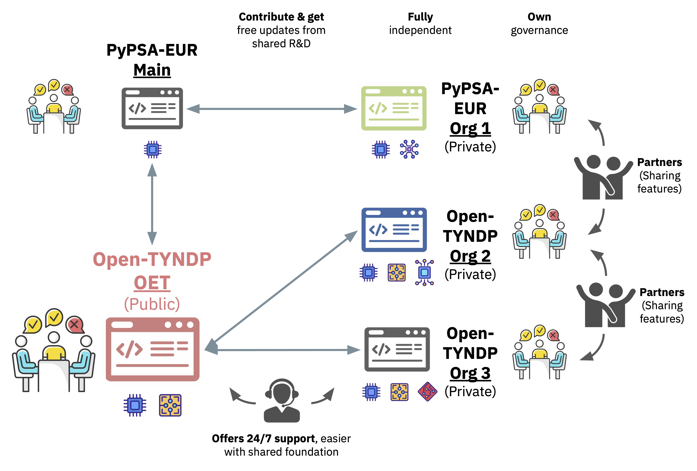

.. SPDX-FileCopyrightText: Contributors to Open-TYNDP <https://github.com/open-energy-transition/open-tyndp>
.. SPDX-FileCopyrightText: Contributors to PyPSA-Eur <https://github.com/pypsa/pypsa-eur>
..
.. SPDX-License-Identifier: CC-BY-4.0

#############################################################################################################
Open-TYNDP: Interfacing Open Energy System Planning with ENTSO-E Models and Contributing to TYNDP
#############################################################################################################

.. image:: https://img.shields.io/github/v/release/open-energy-transition/open-tyndp?include_prereleases
    :alt: GitHub release (latest by date including pre-releases)

.. image:: https://img.shields.io/github/commits-difference/open-energy-transition/open-tyndp?base=master&head=PyPSA:pypsa-eur:master&label=commits%20behind%20PyPSA-Eur
    :alt: commits behind PyPSA-Eur

.. image:: https://github.com/open-energy-transition/open-tyndp/actions/workflows/test.yaml/badge.svg
    :target: https://github.com/open-energy-transition/open-tyndp/actions

.. image:: https://readthedocs.org/projects/pypsa-eur/badge/?version=latest
    :target: https://pypsa-eur.readthedocs.io/en/latest/?badge=latest
    :alt: Documentation

.. image:: https://img.shields.io/github/repo-size/open-energy-transition/open-tyndp
    :alt: GitHub repo size

.. image:: https://zenodo.org/badge/DOI/10.5281/zenodo.3520874.svg
    :target: https://doi.org/10.5281/zenodo.3520874

.. image:: https://zenodo.org/badge/DOI/10.5281/zenodo.14230568.svg
    :target: https://doi.org/10.5281/zenodo.14230568

.. image:: https://img.shields.io/badge/snakemake-≥7.19-brightgreen.svg?style=flat
    :target: https://snakemake.readthedocs.io
    :alt: Snakemake

.. image:: https://img.shields.io/discord/911692131440148490?logo=discord
    :target: https://discord.gg/AnuJBk23FU
    :alt: Discord

.. image:: https://api.reuse.software/badge/github.com/open-energy-transition/open-tyndp
    :target: https://api.reuse.software/info/github.com/open-energy-transition/open-tyndp
    :alt: REUSE

|

.. warning::
    Open-TYNDP is under active development and is not yet feature-complete. The current `development status <https://open-tyndp.readthedocs.io/en/latest/index.html#development-status>`__ and the general `Limitations <https://open-tyndp.readthedocs.io/en/latest/limitations.html>`__ are important to understand before using the model.

This repository introduces the open model dataset of the Open-TYNDP research and innovation project, which is a collaboration between `Open Energy Transition (OET) <https://openenergytransition.org/>`__ and the European Network of Transmission System Operators for Electricity (ENTSO-E). The project’s aim is to explore and consider the adoption of PyPSA in the Ten-Year Network Development Plan (TYNDP) by building a workflow based on `PyPSA-Eur <https://github.com/pypsa/pypsa-eur>`__. It seeks to complement the tools currently used in the TYNDP cycles, especially for Scenario Building (SB) and Cost-Benefit Analysis (CBA). This approach is designed to enhance transparency and lower barriers to stakeholder participation in European energy planning. Beyond Europe, the project aspires to demonstrate the viability of open-source (OS) frameworks in energy planning, encouraging broader global adoption.

To build trust in and ensure reproducibility with the new open-source toolchain, the project first focuses on replicating key figures from the 2024 TYNDP cycle, before aligning with the current 2026 TYNDP cycle. This process involves developing new features within the open-source domain to address existing gaps, integrating tools for data interoperability and dynamic visualizations, and publishing best practices to encourage the adoption of open energy models. Additionally, the project emphasizes stakeholder consultations and `interactive workshops <https://open-energy-transition.github.io/open-tyndp-workshops/intro.html>`__ alongside the development of the PyPSA tool, further promoting collaboration and transparency throughout the process.

This repository is a soft-fork of `OET/PyPSA-Eur <https://github.com/open-energy-transition/pypsa-eur>`__ and contains the entire project `Open-TYNDP` supported by OET, including code and documentation. The philosophy behind this repository is that no intermediary results are included, but all results are computed from raw data and code.

This repository is maintained using `OET's soft-fork strategy <https://open-energy-transition.github.io/handbook/docs/Engineering/SoftForkStrategy>`__. OET's primary aim is to contribute as much as possible to the open-source (OS) upstream repositories. For long-term changes that cannot be directly merged upstream, the strategy organizes and maintains OET forks, ensuring they remain up-to-date and compatible with upstream on a regular basis, while also supporting future contributions back to the OS repositories.

|

Open-Source ecosystem
==================

The Open-TYNDP repository builds on the open-source ecosystem of `PyPSA <https://github.com/pypsa/pypsa>`__ and `PyPSA-Eur <https://github.com/pypsa/pypsa-eur>`__ which are developed and maintained by several organizations, including `Open Energy Transition (OET) <https://openenergytransition.org/>`__, `Technische Universität Berlin (TUB) <https://www.tu.berlin/en/ensys/>`__, `Fraunhofer <https://www.fraunhofer.de/>`__, `Ostbayerische Technische Hochschule (OTH) <https://www.oth-regensburg.de/en/>`__, `Universita di Pisa (UNIPI) <https://www.unipi.it/en/>`__ and `Danmarks Tekniske Universitet (DTU) <https://www.dtu.dk/english/>`__. This group of maintainers consists of individuals who have significantly contributed to the projects over time and earned the authority to review and accept change requests. This privilege comes with the responsibility to continuously work on the repository and contribute to enhancements, stability, security and more. This worldwide ecosystem involves energy researchers, system operators, regulators, NGOs, and policymakers.

Within this ecosystem, independent organisations can develop their own private repositories using the publicly available Open-TYNDP and PyPSA-Eur codebases. This shared foundation ensures interoperability and creates opportunities for partnership through sharing and co-developing features. By using a soft-fork strategy, each private repository can contribute to and benefit from the shared research and development environment. The shared foundation also enables organisations to request support and feature development from other actors.

Each organisation in this open-source ecosystem remains fully independent of the shared foundation, maintaining its own governance structure and decision-making processes regarding its codebase. Organisations are also free to keep parts of their code private.

|

Development status
==================

.. warning::
    Open-TYNDP is under active development and is not yet feature-complete. The current development status and general :doc:`limitations` are important to understand before using the model. The model includes partial data from the TYNDP 2024 cycle, and its validation is ongoing. The github repository `issues <https://github.com/open-energy-transition/open-tyndp/issues>`__ collects known topics we are working on (please feel free to help or make suggestions). The fact that this project relies on a soft-fork strategy implies that `upstream issues <https://github.com/PyPSA/PyPSA-Eur/issues>`__ need to be addressed in the PyPSA-Eur repository. This `documentation <https://open-tyndp.readthedocs.io/>`__ also remains work in progress.

Already implemented features
-------------------------------

The back-casting of the 2024 TYNDP cycle involves developing new features based on the published `modelling methodology report <https://2024.entsos-tyndp-scenarios.eu/wp-content/uploads/2025/01/TYNDP_2024_Scenarios_Methodology_Report_Final_Version_250128.pdf>`__. Major and already implemented features are summarized below. Please, refer to the :doc:`release_notes` for a more comprehensive list of features and to the relevant `pull requests <https://github.com/open-energy-transition/open-tyndp/pulls?q=is%3Apr+label%3A%22major+feature%22>`__ for extensive documentation of the implementations.

- Introduced a new electricity base network using TYNDP 2024 electricity reference grid data (see PR `#18 <https://github.com/open-energy-transition/open-tyndp/pull/18>`__).
- Added option to use the TYNDP H2 topology including the TYNDP H2 reference grid, H2 Z1 and Z2 setup, production, reconversion and storage technologies (see PR `#17 <https://github.com/open-energy-transition/open-tyndp/pull/17>`__).
- Added TYNDP hydrogen import potentials and corridors from outside of the modelled countries (see PR `#36 <https://github.com/open-energy-transition/open-tyndp/pull/36>`__).
- Added the TYNDP electricity demand as an exogenously set demand (see PR `#14 <https://github.com/open-energy-transition/open-tyndp/pull/14>`__).
- Added processing and preparation of TYNDP 2024 PECD v3.1 renewable profiles for offshore wind farms, replacing default ERA5-based profiles processed with Atlite (see PR `#53 <https://github.com/open-energy-transition/open-tyndp/pull/53>`__).
- Introduced TYNDP offshore wind hubs topology with both electric and hydrogen infrastructure, offshore electrolysers, and detailed wind farm characteristics (see PR `#54 <https://github.com/open-energy-transition/open-tyndp/pull/54>`__).
- Introduce a benchmarking framework that assesses Open-TYNDP quality against published TYNDP 2024 data (see PR `#73 <https://github.com/open-energy-transition/open-tyndp/pull/73>`__) and Visualisation Platform data (see PR `#117 <https://github.com/open-energy-transition/open-tyndp/pull/117>`__).
- Added processing and preparation of PEMMDB v2.4 capacity, must-run, and availability data, along with expansion trajectories for conventional and renewable power generation, electrolysers, batteries, and DSR (see PR `#97 <https://github.com/open-energy-transition/open-tyndp/pull/97>`__).
- Attached both solar and onwind technologies using PEMMDB and PECD data (see PR `#115 <https://github.com/open-energy-transition/open-tyndp/pull/115>`__ and PR `#139 <https://github.com/open-energy-transition/open-tyndp/pull/139>`__).

.. list-table::
   :align: center
   :widths: 20 40 40
   :header-rows: 1

   * - **Feature**
     - **TYNDP 2024 topology**
     - **Open-TYNDP topology**
   * - **Electricity Grid**
     - .. image:: img/tyndp/electricity-grid-report.png
          :height: 300px
          :align: center
          :alt: TYNDP 2024 electricity topology
     - .. image:: img/tyndp/electricity-grid.png
          :height: 300px
          :align: center
          :alt: Open-TYNDP electricity topology
   * - **Hydrogen Grid**
     - .. image:: img/tyndp/h2-grid-report.png
          :height: 300px
          :align: center
          :alt: TYNDP 2024 hydrogen topology
     - .. image:: img/tyndp/h2-grid.png
          :height: 300px
          :align: center
          :alt: Open-TYNDP hydrogen topology
   * - **Offshore Grid**
     - .. image:: img/tyndp/offshore-grid-report.png
          :height: 300px
          :align: center
          :alt: TYNDP 2024 offshore topology
     - .. image:: img/tyndp/offshore-grid.png
          :height: 300px
          :align: center
          :alt: Open-TYNDP offshore topology
|

Features in development
--------------------------

While multiple TYNDP features are already introduced to the Open-TYNDP model, there are several other features and assumptions that are still in development and currently rely on default implementations and assumptions from PyPSA-Eur.

.. list-table::
   :align: center
   :widths: 35 35 20 10
   :header-rows: 1

   * - **Milestone**
     - **Feature**
     - **PR**
     - **Status**
   * - **Visualizations and workflow automation**
     - Automated workflow
     -
     - ✅
   * -
     - TYNDP plotting routines
     -
     - ⌛
   * - **Automated tests and benchmarks**
     - Automated benchmarking routine
     - `#73 <https://github.com/open-energy-transition/open-tyndp/pull/73>`__, `#117 <https://github.com/open-energy-transition/open-tyndp/pull/117>`__
     - ✅
   * - **TYNDP modelling features**
     - Perfect foresight optimization
     -
     - ⌛
   * -
     - Security of Supply (SoS) loop
     -
     - ⌛
   * - **Existing infrastructure and associated parameters**
     - Electricity reference grid
     - `#18 <https://github.com/open-energy-transition/open-tyndp/pull/18>`__
     - ✅
   * -
     - Hydrogen reference grid
     - `#17 <https://github.com/open-energy-transition/open-tyndp/pull/17>`__, `#36 <https://github.com/open-energy-transition/open-tyndp/pull/36>`__
     - ✅
   * -
     - Offshore grid
     - `#54 <https://github.com/open-energy-transition/open-tyndp/pull/54>`__
     - ✅
   * -
     - PECD data
     - `#53 <https://github.com/open-energy-transition/open-tyndp/pull/53>`__, `#71 <https://github.com/open-energy-transition/open-tyndp/pull/71>`__
     - ✅
   * -
     - Hydro inflows
     - `#77 <https://github.com/open-energy-transition/open-tyndp/pull/77>`__
     - ✅
   * -
     - PEMMDB capacities & must-runs processing
     - `#97 <https://github.com/open-energy-transition/open-tyndp/pull/97>`__
     - ✅
   * -
     - Investment candidates trajectories processing
     - `#97 <https://github.com/open-energy-transition/open-tyndp/pull/97>`__
     - ✅
   * - **TYNDP demand**
     - Electricity
     - `#14 <https://github.com/open-energy-transition/open-tyndp/pull/14>`__
     - ✅
   * -
     - Hydrogen
     - `#169 <https://github.com/open-energy-transition/open-tyndp/pull/169>`__, `#230 <https://github.com/open-energy-transition/open-tyndp/pull/230>`__
     - ✅
   * -
     - Methane
     - `#208 <https://github.com/open-energy-transition/open-tyndp/pull/208>`__, `#220 <https://github.com/open-energy-transition/open-tyndp/pull/220>`__
     - 🔨
   * -
     - Synthetic fuels
     -
     - ⌛
   * -
     - District heating
     -
     - ⌛
   * -
     - Energy imports
     -
     - ⌛
   * - **TYNDP technologies and carriers**
     - TYNDP generation technologies (incl. SRES and DRES)
     - `#115 <https://github.com/open-energy-transition/open-tyndp/pull/115>`__, `#139 <https://github.com/open-energy-transition/open-tyndp/pull/139>`__, `#195 <https://github.com/open-energy-transition/open-tyndp/pull/195>`__
     - 🔨
   * -
     - Prosumer modelling
     -
     - ⌛
   * -
     - EV modelling
     -
     - ⌛
   * -
     - Synthetic fuel carriers
     -
     - ⌛
   * -
     - Hybrid heat pumps
     -
     - ⌛
   * -
     - Industrial electricity and hydrogen demands
     -
     - ⌛
   * -
     - Hydrogen zones
     - `#17 <https://github.com/open-energy-transition/open-tyndp/pull/17>`__
     - ✅
   * - **CBA Assessment Framework**
     - TOOT/PINT methodology
     -
     - ⌛
   * -
     - Climate years (weighted average)
     -
     - ⌛
   * -
     - CBA Benchmarking
     -
     - ⌛
   * - **CBA Benefit Indicators**
     - B1: Socioeconomic Welfare (SEW)
     -
     - ⌛
   * -
     - B2: CO₂ Variation with societal costs
     -
     - ⌛
   * -
     - B3: DRES Integration (curtailment reduction)
     -
     - ⌛
   * -
     - B4: Non-CO₂ Emissions (NOx, SOx, PM2.5/10, NMVOC, NH₃)
     -
     - ⌛
   * -
     - B5: Grid Losses, B6: Adequacy, B7: Flexibility, B8: Stability, B9: Reserves reduction
     -
     - ⌛

.. seealso::
  See also the `GitHub repository issues <https://github.com/open-energy-transition/open-tyndp/issues>`__ for a comprehensive list of currently open issues.

Background on PyPSA-Eur
=========

Electricity System
------------------

The electricity system representation contains alternating current lines at
and above 220 kV voltage level and all high voltage direct current lines,
substations, an open database of conventional power plants, time series for
electrical demand and variable renewable generator availability, geographic
potentials for the expansion of wind and solar power.

The model is suitable both for operational studies and generation and
transmission expansion planning studies. The continental scope and highly
resolved spatial scale enables a proper description of the long-range smoothing
effects for renewable power generation and their varying resource availability.

.. image:: img/elec.png
    :width: 70%
    :align: center

|

Sector-Coupled Energy System
----------------------------

A sector-coupled extension (previously known as **PyPSA-Eur-Sec**, which is now
deprecated) adds demand and supply for the following sectors: transport, space
and water heating, biomass, energy consumption in the agriculture, industry and
industrial feedstocks, carbon management, carbon capture and
usage/sequestration. This completes the energy system and includes all
greenhouse gas emitters except waste management, agriculture, forestry and land
use. The diagram below gives an overview of the sectors and the links between
them:

.. image:: img/multisector_figure.png
    :width: 70%
    :align: center

.. note::
    You can find showcases of the model's capabilities in the Supplementary Materials of the
    Joule paper `The potential role of a hydrogen network in Europe
    <https://doi.org/10.1016/j.joule.2023.06.016>`__, the Supplementary Materials of another `paper in Joule with a
    description of the industry sector
    <https://doi.org/10.1016/j.joule.2022.04.016>`__, or in `a 2021 presentation
    at EMP-E <https://nworbmot.org/energy/brown-empe.pdf>`__.
    The sector-coupled extension of PyPSA-Eur was
    initially described in the paper `Synergies of sector coupling and transmission
    reinforcement in a cost-optimised, highly renewable European energy system
    <https://arxiv.org/abs/1801.05290>`__ (2018) but it differs by being based on the
    higher resolution electricity transmission model `PyPSA-Eur
    <https://github.com/PyPSA/pypsa-eur>`__ rather than a one-node-per-country model,
    and by including biomass, industry, industrial feedstocks, aviation, shipping,
    better carbon management, carbon capture and usage/sequestration, and gas
    networks.

About
-----

PyPSA-Eur is designed to be imported into the open energy system modelling
framework `PyPSA <https://www.pypsa.org>`__ for which `documentation
<https://pypsa.readthedocs.io>`__ is available as well. However, since the
workflow is modular, it should be easy to adapt the data workflow to other
modelling frameworks.

The restriction to freely available and open data encourages the open exchange
of model data developments and eases the comparison of model results. It
provides a full, automated software pipeline to assemble the load-flow-ready
model from the original datasets, which enables easy replacement and improvement
of the individual parts.

.. warning::
    PyPSA-Eur is under active development and has several
    :doc:`limitations` which
    you should understand before using the model. The Github repository
    `issues <https://github.com/PyPSA/pypsa-eur/issues>`__ collect known
    topics we are working on. Please feel free to help or make suggestions.

This project is currently maintained by the `Department of Digital
Transformation in Energy Systems <https://www.tu.berlin/en/ensys>`__ at the
`Technische Universität Berlin <https://www.tu.berlin>`__. Previous versions were
developed within the `IAI <http://www.iai.kit.edu>`__ at the `Karlsruhe Institute
of Technology (KIT) <http://www.kit.edu/english/index.php>`__ which was funded by
the `Helmholtz Association <https://www.helmholtz.de/en/>`__, and by the
`Renewable Energy Group
<https://fias.uni-frankfurt.de/physics/schramm/renewable-energy-system-and-network-analysis/>`__
at `FIAS <https://fias.uni-frankfurt.de/>`__ to carry out simulations for the
`CoNDyNet project <http://condynet.de/>`__, financed by the `German Federal
Ministry for Education and Research (BMBF) <https://www.bmbf.de/en/index.html>`__
as part of the `Stromnetze Research Initiative
<http://forschung-stromnetze.info/projekte/grundlagen-und-konzepte-fuer-effiziente-dezentrale-stromnetze/>`__.

Workflow
--------

.. image:: img/workflow.png
    :class: full-width
    :align: center

.. note::
    The graph above was generated using
    ``pixi run dot -c && snakemake --rulegraph -F | sed -n "/digraph/,/}/p" | dot -Tpng -o doc/img/workflow.png``

Learning Energy System Modelling
--------------------------------

If you are (relatively) new to energy system modelling and optimisation and plan
to use PyPSA-Eur, the following resources are one way to get started in addition
to reading this documentation.

- Documentation of `PyPSA <https://pypsa.readthedocs.io>`__, the package for
  modelling energy systems which PyPSA-Eur uses under the hood.
- Course on `Energy Systems <https://nworbmot.org/courses/es-22/>`__ given at
  Technical University of Berlin by `Prof. Dr. Tom Brown <https://nworbmot.org>`__.
- Course on `Data Science for Energy System Modelling <https://fneum.github.io/data-science-for-esm/intro.html>`__
  given at Technical University of Berlin by `Dr. Fabian Neumann <https://neumann.fyi>`__.

Citing PyPSA-Eur
----------------

If you use PyPSA-Eur for your research, we would appreciate it if you would cite one of the following papers:

For electricity-only studies: ::

    @article{PyPSAEur,
        author = "Jonas Hoersch and Fabian Hofmann and David Schlachtberger and Tom Brown",
        title = "PyPSA-Eur: An open optimisation model of the European transmission system",
        journal = "Energy Strategy Reviews",
        volume = "22",
        pages = "207--215",
        year = "2018",
        doi = "10.1016/j.esr.2018.08.012",
        eprint = "1806.01613"
    }

For sector-coupling studies: ::

    @misc{PyPSAEurSec,
        author = "Fabian Neumann and Elisabeth Zeyen and Marta Victoria and Tom Brown",
        title = "The potential role of a hydrogen network in Europe",
        journal = "Joule",
        volume = "7",
        pages = "1--25",
        year = "2023",
        eprint = "2207.05816",
        doi = "10.1016/j.joule.2023.06.016",
    }

For sector-coupling studies with pathway optimisation: ::

    @article{SpeedTechnological2022,
        title = "Speed of technological transformations required in {Europe} to achieve different climate goals",
        author = "Marta Victoria and Elisabeth Zeyen and Tom Brown",
        journal = "Joule",
        volume = "6",
        number = "5",
        pages = "1066--1086",
        year = "2022",
        doi = "10.1016/j.joule.2022.04.016",
        eprint = "2109.09563",
    }

If you want to cite a specific PyPSA-Eur version, each release of PyPSA-Eur is stored on Zenodo with a release-specific DOI:

.. image:: https://zenodo.org/badge/DOI/10.5281/zenodo.3520874.svg
   :target: https://doi.org/10.5281/zenodo.3520874

Operating Systems
-----------------

The PyPSA-Eur workflow is continuously tested for Linux, macOS and Windows (WSL only).

|

.. toctree::
   :hidden:
   :maxdepth: 2
   :caption: Getting Started

   introduction
   installation
   tutorial
   tutorial_sector

.. toctree::
   :hidden:
   :maxdepth: 2
   :caption: Configuration

   wildcards
   configuration
   foresight
   costs

.. toctree::
   :hidden:
   :maxdepth: 2
   :caption: Rules Overview

   retrieve
   preparation
   sector
   solving
   oetc
   plotting

.. toctree::
   :hidden:
   :maxdepth: 2
   :caption: Implementation details for sector-coupled systems

   spatial_resolution
   supply_demand

.. toctree::
   :hidden:
   :maxdepth: 2
   :caption: References

   release_notes
   licenses
   data_sources
   validation
   benchmarking
   limitations
   contributing
   support
   publications
   contributors
